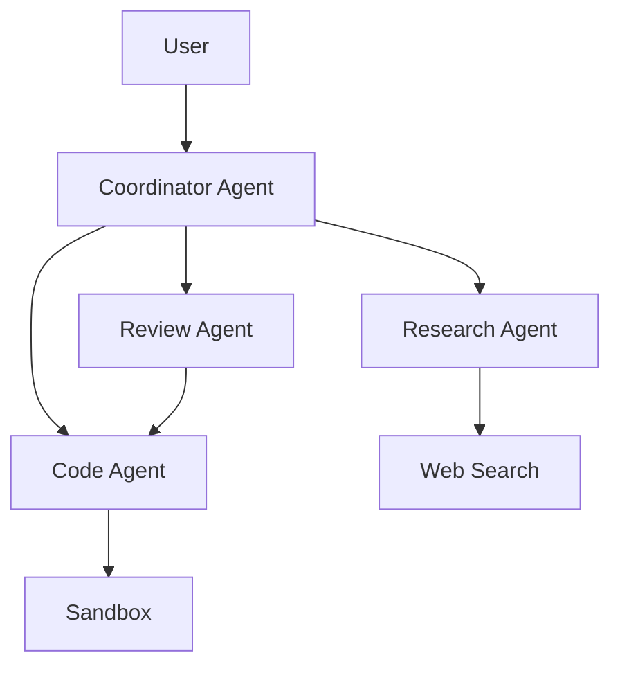
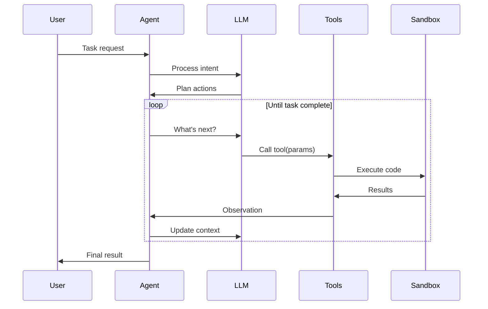
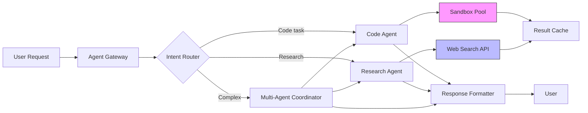
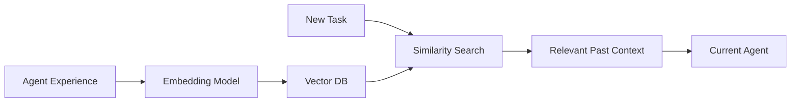

**One-liner:** AI agents are autonomous systems that perceive, reason, and act - combining LLMs with tools, memory, and execution environments.

## Core Components

### 1. Perception Layer
- **Input:** User queries, environment state, tool outputs
- **Processing:** Intent extraction, context building
- **Output:** Structured understanding of task

### 2. Reasoning Engine (LLM Brain)
- **Model selection:** GPT-4, Claude, Llama (tradeoff: capability vs cost)
- **Prompt engineering:** System prompts, few-shot examples, chain-of-thought
- **Decision making:** What actions to take, which tools to call

### 3. Action Layer (Tool Use)
- **Tool calling:** Function invocation with parameters
- **Code execution:** Running user/generated code in sandbox
- **API interactions:** External service calls

### 4. Memory Systems
- **Short-term:** Conversation context (last N tokens)
- **Long-term:** Vector DB (embeddings), traditional DB (facts)
- **Working memory:** Current task state, intermediate results

## Agent Types

### ReAct (Reason + Act) Pattern
```
Thought: I need to search for current weather
Action: search("San Francisco weather")
Observation: 65°F, sunny
Thought: Now I can answer
Action: respond("It's 65°F and sunny")
```

**Pros:** Interpretable, controllable | **Cons:** Slower (sequential), token-heavy

### Tool-Calling Agents
```json
{
  "tool": "code_execution",
  "parameters": {
    "code": "print(sum([1,2,3]))",
    "language": "python"
  }
}
```

**Pros:** Fast, native model support | **Cons:** Less interpretable, model-dependent

### Multi-Agent Systems


**Pros:** Specialization, parallel work | **Cons:** Coordination complexity, cost

## Agent Execution Loop



**Key insight:** Agent loop = Observe → Think → Act → Repeat

## Tool Design Principles

### 1. Atomic Operations
- Each tool does ONE thing well
- ✅ `read_file(path)` vs ❌ `read_and_process_file(path, operation)`

### 2. Idempotent When Possible
- Same input → same output (no side effects)
- Safe to retry on failure

### 3. Clear Error Handling
```python
{
  "success": false,
  "error": "FileNotFoundError: config.json",
  "suggestion": "Check file path or use list_files() tool"
}
```

### 4. Structured Input/Output
- JSON schemas for validation
- Type hints for LLM guidance

## Agent Challenges

| Challenge | Impact | Solution |
|-----------|--------|----------|
| **Hallucinated tool calls** | Invalid actions | Schema validation, retry logic |
| **Infinite loops** | Resource drain | Step limits, timeout budgets |
| **Context overflow** | Lost information | Summarization, memory pruning |
| **Tool misuse** | Unintended actions | Permission systems, sandboxing |
| **Error cascades** | Task failure | Graceful degradation, checkpoints |

## Production Architecture Example



## Common Patterns

### 1. Retry with Backoff
```python
for attempt in range(MAX_RETRIES):
    result = agent.run(task)
    if result.success:
        return result
    wait(2 ** attempt)  # Exponential backoff
```

### 2. Prompt Chaining
```
Step 1: Plan the approach → planAgent
Step 2: Execute subtasks → executionAgent
Step 3: Review & test → reviewAgent
Step 4: Summarize results → summaryAgent
```

### 3. Human-in-the-Loop
- Ask for approval before destructive actions
- Request clarification when ambiguous
- Present options for user choice

## Latency Budgets

| Component | Target Latency | Optimization |
|-----------|---------------|--------------|
| LLM inference | 1-3s | Smaller models, streaming |
| Tool execution | 0.5-2s | Caching, parallel calls |
| Code sandbox | 2-10s | Container reuse, snapshots |
| Total per step | 5-15s | Async operations, timeouts |

**Staff-level insight:** 90% of users tolerate 5s, drop-off increases 10% per additional second

## Memory Management

### Context Window Usage
```
System prompt:        500 tokens (5%)
Tool definitions:   1,000 tokens (10%)
Conversation:       6,000 tokens (60%)
Working memory:     2,000 tokens (20%)
Buffer:               500 tokens (5%)
Total:             10,000 tokens
```

**Strategies:**
- **Summarization:** Compress old messages
- **Pruning:** Remove irrelevant history
- **Extraction:** Key facts to long-term memory

### Vector Memory


**Use cases:** Similar task retrieval, RAG for documentation, error pattern matching

## Key Takeaways

- **Agents = LLM + Tools + Memory + Loop** - missing any piece breaks autonomy
- **ReAct pattern** is interpretable, tool-calling is fast - choose based on needs
- **Sandbox isolation** is non-negotiable for code execution (security)
- **Multi-agent** systems scale better than monolithic agents for complex tasks
- **Error handling** is 50% of production agent code - plan for failures
- **Latency compounds** - each agent step adds 5-15s, optimize aggressively
- **Context management** is critical - summarize, prune, or cache intelligently
- **Human-in-the-loop** for ambiguity and destructive actions increases trust

## Interview Focus

- **High frequency:** Agent loop, ReAct pattern, tool design, error handling
- **Design questions:** "Design an agent that can debug production issues"
- **Trade-offs:** Autonomy vs safety, speed vs interpretability
- **Scale:** How to handle 1000s of concurrent agent sessions
