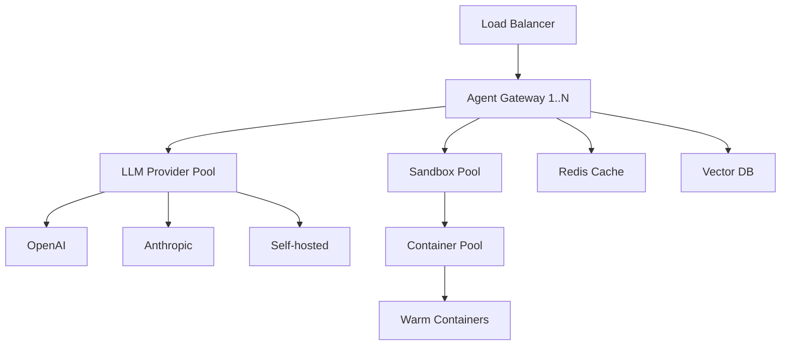

**One-liner:** Test your understanding of AI agent fundamentals, patterns, and production considerations.

## Conceptual Questions

### Q1: What are the four core components of an AI agent?
<details>
<summary>Answer</summary>

1. **Perception Layer** - processes inputs and extracts intent
2. **Reasoning Engine (LLM)** - makes decisions and plans actions
3. **Action Layer** - executes tools and code
4. **Memory Systems** - maintains short-term and long-term context

Missing any component significantly reduces agent autonomy and capability.
</details>

### Q2: Compare ReAct pattern vs Tool-Calling pattern
<details>
<summary>Answer</summary>

| Aspect | ReAct | Tool-Calling |
|--------|-------|--------------|
| **Interpretability** | High (explicit reasoning) | Lower (direct calls) |
| **Speed** | Slower (sequential) | Faster (native) |
| **Token usage** | Heavy (verbose) | Lighter (structured) |
| **Control** | Easy to debug | Model-dependent |
| **Best for** | Complex reasoning | Production speed |

**When to use:**
- ReAct: Debugging, transparency needed, complex multi-step tasks
- Tool-calling: Production APIs, latency-sensitive, simple operations
</details>

### Q3: Why is sandboxing non-negotiable for code execution?
<details>
<summary>Answer</summary>

**Security risks without sandboxing:**
- Arbitrary code execution on host system
- File system access/deletion
- Network calls to internal services
- Resource exhaustion (CPU, memory, disk)
- Data exfiltration

**Required isolation:**
- Process isolation (containers, VMs)
- Network isolation (no egress without allowlist)
- Filesystem isolation (read-only mounts)
- Resource limits (CPU, memory, time)

**Real-world example:** GitHub Copilot Workspace runs code in isolated containers with no network access.
</details>

### Q4: What causes agent infinite loops and how to prevent them?
<details>
<summary>Answer</summary>

**Common causes:**
1. Agent doesn't recognize task completion
2. Tool failures not handled, agent retries indefinitely
3. Ambiguous stopping conditions
4. Agent forgets previous attempts (context overflow)

**Prevention strategies:**
```python
# 1. Step limits
if steps > MAX_STEPS:
    return "Exceeded step limit"

# 2. Timeout budgets
if time.now() - start_time > TIMEOUT:
    return "Task timeout"

# 3. Duplicate action detection
if action in recent_actions:
    return "Detected loop, stopping"

# 4. Explicit stopping criteria in prompt
"Stop when: 1) task complete, 2) unrecoverable error, 3) need user input"
```

**Staff-level insight:** Add circuit breakers - if same tool fails 3x, escalate to human.
</details>

## Design Questions

### Q5: Design an agent to debug production outages
<details>
<summary>Answer</summary>

**Requirements:**
- Access logs, metrics, traces
- Run diagnostic commands
- Query databases safely
- Correlate signals across services

**Architecture:**
```
1. Triage Agent
   - Analyzes alert, categorizes severity
   - Tools: log_search, metric_query, trace_lookup

2. Investigation Agent
   - Runs read-only queries
   - Tools: db_query (read-only), service_status, recent_deploys
   - Sandbox: Isolated query environment

3. Root Cause Agent
   - Correlates findings
   - Memory: Past incidents, runbooks
   - Output: Probable cause + remediation steps

4. Human Review
   - Present findings for approval
   - Execute remediation with human-in-loop
```

**Key considerations:**
- All queries MUST be read-only
- No automatic deployments
- Timeout: 5 min (users expect fast triage)
- Audit trail: Log all actions

**Trade-offs:**
- Autonomy vs safety: Lean towards safety for production
- Speed vs accuracy: 80% accurate in 2 min > 95% in 10 min
</details>

### Q6: How would you scale an agent system to 10K concurrent users?
<details>
<summary>Answer</summary>

**Bottlenecks:**
1. LLM API rate limits
2. Sandbox creation time
3. Memory/context storage
4. Tool execution latency

**Solutions:**



**1. LLM scaling:**
- Multi-provider fallback (OpenAI → Anthropic → self-hosted)
- Request queuing with priority
- Smaller models for simple tasks

**2. Sandbox pooling:**
- Pre-warm 100 containers
- Reuse containers between sessions (reset state)
- Scale out on demand (K8s HPA)
- Lazy loading: Create sandbox only when code execution needed

**3. Caching:**
- Tool results: Hash(tool + params) → result
- LLM responses: Semantic cache for similar queries
- Context: Compress old messages

**4. Async operations:**
- Long-running tasks → background jobs
- Streaming responses for UX

**Numbers:**
- 10K users × 10 steps/session × 5s/step = 500K step-seconds/session burst
- Need: 100 LLM QPS, 200 sandboxes (if 20% tasks use code)
- Cost: ~$50K/mo at scale (mostly LLM)
</details>

## Scenario Questions

### Q7: Agent gets into error cascade - same tool fails repeatedly. How to handle?
<details>
<summary>Answer</summary>

**Problem:** Tool fails → Agent retries → Fails again → Retries → ...

**Solution layers:**

**1. Immediate (tool-level):**
```python
def execute_tool(tool, params, attempt=0):
    if attempt >= MAX_RETRIES:
        return {
            "success": False,
            "error": "Max retries exceeded",
            "suggestion": "Try alternative approach or ask user"
        }

    result = tool.run(params)
    if result.error and is_retryable(result.error):
        sleep(2 ** attempt)
        return execute_tool(tool, params, attempt + 1)

    return result
```

**2. Agent-level:**
- Track recent failures in context
- After 3 failures, inject prompt: "Tool X is failing, try alternative approach"
- Provide fallback tools (e.g., if file_read fails, try list_directory)

**3. System-level:**
- Circuit breaker: After N consecutive failures, disable tool for T seconds
- Escalation: "I'm unable to complete this task due to [error]. Options: 1) Try manual approach, 2) Skip this step, 3) Stop task"

**Real example (Claude Code):**
If Read tool fails 3x → Suggests using Grep or Glob instead
</details>

### Q8: User asks agent to "optimize this codebase" - too vague. What's your strategy?
<details>
<summary>Answer</summary>

**Problem:** Ambiguous scope, multiple valid approaches, high risk of wasted effort

**Strategy:**

**1. Clarification Agent:**
```
Ask user:
- What type of optimization? (speed, memory, readability, bundle size)
- Current pain points? (slow endpoints, large bundle, etc.)
- Acceptable trade-offs? (complexity vs performance)
- Scope: Entire codebase or specific module?
```

**2. If user unclear, provide options:**
```
"I can optimize for:
1. Performance (profile → optimize hotspots) - Recommended
2. Bundle size (analyze imports → tree-shake)
3. Memory usage (profile heap → fix leaks)
4. Code quality (linting, refactoring)

Which matters most for your use case?"
```

**3. Start with profiling:**
```python
# Don't optimize blindly
steps = [
    "Run performance profiler",
    "Identify bottlenecks (top 3)",
    "Estimate impact (20% improvement vs 2%)",
    "Get user approval on plan",
    "Implement optimizations",
    "Benchmark results"
]
```

**Staff-level insight:** Optimization without data = guessing. Always profile first.

**Common pitfall:** Spending 2 hours optimizing something that takes 0.01s → negligible impact
</details>

## Memory Drills

### Q9: Quick recall - Agent execution loop steps
<details>
<summary>Answer</summary>

1. **Observe** - Get task/observation from environment
2. **Think** - LLM reasons about next action
3. **Act** - Execute tool or return response
4. **Repeat** - Loop until task complete

Mnemonic: **OTAR** (Oh-Tar)
</details>

### Q10: Quick recall - Three types of agent memory
<details>
<summary>Answer</summary>

1. **Short-term** - Current conversation context (last N tokens)
2. **Long-term** - Vector DB for semantic search of past experiences
3. **Working memory** - Current task state, intermediate results

Mnemonic: **SLW** (Slow = bad for agents, need fast memory access)
</details>

## Common Mistakes to Avoid

### Mistake 1: Forgetting error handling
```python
# ❌ Bad
result = agent.run(task)
return result.output

# ✅ Good
try:
    result = agent.run(task, timeout=30)
    if not result.success:
        return handle_failure(result.error)
    return result.output
except TimeoutError:
    return "Task exceeded time budget"
```

### Mistake 2: Unbounded resource usage
```python
# ❌ Bad - Agent can run forever
while not task_complete:
    agent.step()

# ✅ Good
for step in range(MAX_STEPS):
    if task_complete or time_exceeded:
        break
    agent.step()
```

### Mistake 3: No human-in-loop for critical actions
```python
# ❌ Bad
if action.type == "delete_database":
    execute(action)

# ✅ Good
if action.is_destructive():
    approval = ask_user(f"About to {action}. Approve?")
    if approval:
        execute(action)
```

## Key Takeaways

- Know the agent loop cold: **Observe → Think → Act → Repeat**
- **ReAct** = interpretable, **Tool-calling** = fast - pick based on requirements
- **Sandbox everything** - security is non-negotiable
- **Circuit breakers** and step limits prevent infinite loops
- **Human-in-loop** for ambiguous/destructive actions
- **Profile before optimizing** - data beats intuition
- **Error handling** is 50% of production code - plan for it
- **Multi-agent > Monolithic** for complex tasks at scale

## Self-Test Checklist

Can you:
- [ ] Explain the four core components of an agent?
- [ ] Describe the agent execution loop from memory?
- [ ] Compare ReAct vs Tool-calling patterns?
- [ ] List three ways to prevent infinite loops?
- [ ] Design a simple multi-agent system for a task?
- [ ] Explain why sandboxing is critical?
- [ ] Name three types of agent memory?
