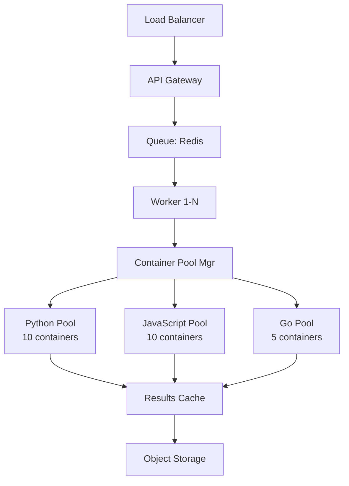
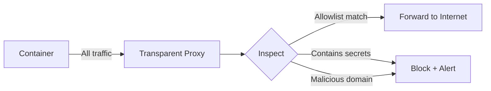

**One-liner:** Test your understanding of code sandboxing, isolation technologies, and security patterns.

## Conceptual Questions

### Q1: Why can't you just use Python's `exec()` without a sandbox?
<details>
<summary>Answer</summary>

**`exec()` has ZERO isolation:**
```python
# User code can do ANYTHING
exec("import os; os.system('rm -rf /')")  # Delete everything
exec("import socket; socket.connect(('evil.com', 443))")  # Network access
exec("open('/etc/passwd').read()")  # Read sensitive files
exec("while True: pass")  # Infinite loop, no timeout
```

**Why `exec()` is dangerous:**
- Same process as your application (shared memory)
- Full filesystem access
- Network access
- No resource limits
- No timeout enforcement
- Can import any module

**Only acceptable use:** Trusted code in isolated environments (e.g., Jupyter notebooks where user owns the machine)

**Interview insight:** If candidate suggests `exec()` without sandboxing, it's a red flag on security awareness.
</details>

### Q2: Compare Docker vs Firecracker vs gVisor
<details>
<summary>Answer</summary>

| Aspect | Docker | Firecracker | gVisor |
|--------|--------|-------------|--------|
| **Isolation** | Process (namespaces) | Full VM (KVM) | Syscall interception |
| **Boot time** | 1-3s | 125ms | 0.5s |
| **Memory overhead** | ~10MB | ~5MB | ~15MB |
| **Security** | Good | Excellent | Excellent |
| **Ecosystem** | Huge | Limited | Growing |
| **Compatibility** | All Linux apps | All Linux apps | Most apps |
| **Best for** | General production | Cold-start critical | High security needs |

**When to use:**
- **Docker:** Default choice - mature, well-understood, good enough
- **Firecracker:** AWS Lambda, serverless platforms (fast cold start)
- **gVisor:** High security requirements (syscall filtering at kernel level)

**Real-world:**
- Docker: GitHub Copilot Workspace, most CI/CD
- Firecracker: AWS Lambda, Fly.io, Modal
- gVisor: Google Cloud Run, Replit
</details>

### Q3: What are the 5 critical security settings for a Docker sandbox?
<details>
<summary>Answer</summary>

```python
docker.containers.run(
    image="sandbox",

    # 1. No network - prevent exfiltration
    network_mode="none",

    # 2. Resource limits - prevent exhaustion
    mem_limit="512m",
    cpu_quota=100000,
    pids_limit=50,

    # 3. Read-only filesystem - prevent tampering
    read_only=True,

    # 4. Drop capabilities - remove root powers
    cap_drop=["ALL"],

    # 5. Non-root user + security options
    user="1000:1000",  # Non-root
    security_opt=["no-new-privileges"]
)
```

**What each prevents:**
1. Network isolation → Data exfiltration, SSRF attacks
2. Resource limits → DoS via CPU/memory/disk exhaustion
3. Read-only FS → Malware persistence, system tampering
4. Capability drop → Privilege escalation attempts
5. Non-root user → Root exploits have less impact

**Miss ANY of these → Security vulnerability**
</details>

### Q4: Explain container pooling and why it's essential
<details>
<summary>Answer</summary>

**Problem:** Creating containers is slow
```
docker run:              1-3 seconds (cold start)
Pull image (if needed):  10-60 seconds
Total cold:              Up to 60 seconds ❌
```

**Solution:** Pre-create idle containers in a pool

```python
class ContainerPool:
    def __init__(self, size=10):
        # Pre-warm containers at startup
        self.idle_containers = []
        for _ in range(size):
            container = self._create_container()
            self.idle_containers.append(container)

    def get_container(self):
        if self.idle_containers:
            return self.idle_containers.pop()  # 10ms
        else:
            return self._create_container()     # 1-3s (fallback)

    def return_container(self, container):
        self._reset_state(container)  # Clear /tmp, kill processes
        self.idle_containers.append(container)
```

**Performance:**
- Cold start: 1-3 seconds
- Pool hit: 10-50ms (60x faster!)
- Pool miss: Falls back to cold start

**Trade-offs:**
- **Pro:** Dramatically faster execution
- **Con:** Memory overhead (10 containers × 512MB = 5GB)
- **Con:** Must properly reset state between uses

**Production pattern:**
- Min pool size: 10 (for low traffic)
- Max pool size: 100 (for burst traffic)
- Scale pool size based on request rate

**Real-world:** All production systems use pooling (GitHub, Replit, AWS Lambda)
</details>

## Design Questions

### Q5: Design a code execution API for 1M executions/day
<details>
<summary>Answer</summary>

**Requirements:**
- 1M executions/day = ~12 exec/sec average, ~120/sec peak (10x)
- Support Python, JavaScript, Go
- Timeout: 30s per execution
- Security: Full isolation

**Architecture:**



**Components:**

**1. API Gateway:**
```python
@app.post("/execute")
async def execute_code(request: CodeRequest):
    # Validate input (max 10KB code)
    if len(request.code) > 10_000:
        return {"error": "Code too large"}

    # Deduplicate with cache
    cache_key = hash(request.code + request.language)
    if cached := redis.get(cache_key):
        return cached

    # Enqueue job
    job_id = queue.enqueue(
        execute_in_sandbox,
        code=request.code,
        language=request.language,
        timeout=30
    )

    return {"job_id": job_id, "status": "queued"}
```

**2. Worker Pool:**
```python
# Run 10 workers (handle 10 concurrent executions)
# Each worker has container pool

class Worker:
    def __init__(self, language):
        self.pool = ContainerPool(language, size=5)

    def execute(self, code, timeout):
        container = self.pool.get()
        try:
            result = container.exec_run(
                ["python", "-c", code],
                timeout=timeout
            )
            return {"output": result.output}
        finally:
            self.pool.return_container(container)
```

**3. Resource Calculations:**

Peak: 120 executions/sec
Avg execution time: 2 seconds (including queuing)
Concurrent executions: 120 × 2 = 240

Per container: 512MB RAM
Total RAM needed: 240 × 512MB = 120GB

Servers: 120GB / 32GB per server = 4 servers (with headroom: 6 servers)

**4. Cost Estimation:**

Compute: 6 × m5.2xlarge = 6 × $0.384/hr = $2,074/month
Storage: 1TB results = $23/month
Network: Negligible
**Total: ~$2,100/month**

**5. Optimizations:**

- **Caching:** Hash(code) → result (for identical code)
- **Warm pools:** Pre-created containers per language
- **Auto-scaling:** Scale workers based on queue depth
- **Spot instances:** Save 70% on compute
- **Result streaming:** WebSockets for real-time output

**Trade-offs:**
- Queue latency: +100-500ms (acceptable for async)
- Memory: 120GB (manageable with pooling)
- Cost: $2K/mo vs serverless $5-10K/mo (cheaper!)
</details>

### Q6: How do you handle network access in sandboxes safely?
<details>
<summary>Answer</summary>

**Scenarios:**

**1. No network needed (strictest):**
```python
network_mode="none"  # No network interface at all
```
**Use case:** Code evaluation, data processing, transformations

**2. Allowlist specific domains:**
```python
# Use HTTP proxy with allowlist
class AllowlistProxy:
    ALLOWED = ["api.openai.com", "api.anthropic.com"]

    def handle_request(self, request):
        domain = extract_domain(request.url)
        if domain in self.ALLOWED:
            return forward_request(request)
        else:
            return Response(403, "Domain blocked")

# Configure container to use proxy
container = docker.containers.run(
    image="sandbox",
    environment={"HTTP_PROXY": "http://proxy:8080"},
    network_mode="bridge"
)
```

**3. Full internet with DLP (Data Loss Prevention):**
```python
# Inspect all egress traffic
class DLPProxy:
    def inspect_request(self, request):
        # Check for sensitive data
        if contains_secrets(request.body):
            log_security_event("Blocked secret exfiltration")
            return Response(403, "Sensitive data detected")

        # Check for malicious domains
        if is_malicious_domain(request.url):
            return Response(403, "Malicious domain")

        return forward_request(request)
```

**Architecture:**



**Trade-offs:**

| Approach | Security | Flexibility | Latency | Use Case |
|----------|----------|-------------|---------|----------|
| No network | Highest | Lowest | 0ms | Pure computation |
| Allowlist | High | Medium | +10ms | Known API calls |
| DLP | Medium | High | +50ms | User-facing tools |

**Staff-level insight:** Start with no network, add allowlist only when needed, avoid full internet.
</details>

## Scenario Questions

### Q7: Container execution takes 5s, but users expect <1s response. How to optimize?
<details>
<summary>Answer</summary>

**Current bottleneck breakdown:**
```
Container creation:  1500ms
Code execution:      2000ms
Output collection:    500ms
Network overhead:     200ms
Total:               4200ms (too slow!)
```

**Optimizations:**

**1. Container pooling (1500ms → 50ms):**
```python
# Pre-warm 20 containers
pool = ContainerPool(size=20)
container = pool.get()  # 50ms instead of 1500ms
```
Saved: 1450ms

**2. Streaming output (+perceived speed):**
```python
# Stream output as it's generated
for line in container.exec_run(code, stream=True):
    yield f"data: {line}\n\n"  # SSE
```
User sees output immediately (perceived <1s even if total is 3s)

**3. Async execution:**
```python
# Return job_id immediately
@app.post("/execute")
async def execute(code):
    job = queue.enqueue(execute_in_sandbox, code)
    return {"job_id": job.id}  # 20ms response

# Poll for results
@app.get("/results/{job_id}")
async def get_results(job_id):
    return job.result  # Get when ready
```

**4. Result caching:**
```python
# Identical code → cached result
cache_key = hash(code + language)
if cached := redis.get(cache_key):
    return cached  # 5ms cache hit

# Execute and cache
result = execute_in_sandbox(code)
redis.setex(cache_key, 3600, result)  # Cache 1 hour
```

**5. Compile once, run many:**
```python
# For repeated executions with different inputs
compiled = compile(code, '<string>', 'exec')
# Reuse compiled bytecode (saves 100-200ms per run)
```

**Final latency:**
```
Container from pool:    50ms
Code execution:      2000ms (can't optimize much)
Streaming output:       0ms (parallel)
Network:              200ms
Total:               2250ms

With caching hit:       5ms (identical code)
With async pattern:    20ms (return job_id)
```

**Trade-offs:**
- Pooling: Memory overhead (20 × 512MB = 10GB)
- Caching: Stale results if code has side effects
- Async: User needs to poll (worse UX)

**Recommendation:** Pooling + streaming + caching = best balance
</details>

### Q8: User code creates 10,000 files and exhausts disk. How to prevent?
<details>
<summary>Answer</summary>

**Attack:**
```python
# Malicious code
for i in range(10_000):
    with open(f"/tmp/file_{i}", "wb") as f:
        f.write(b"A" * 1_000_000)  # 1MB each = 10GB total
```

**Prevention layers:**

**1. Storage quota (Docker):**
```python
# Limit writable layer to 1GB
container = docker.containers.run(
    image="sandbox",
    storage_opt={"size": "1G"},
    read_only=True,
    tmpfs={"/tmp": "size=100m"}  # Only /tmp writable, max 100MB
)
```

**2. Inode limits:**
```bash
# Limit number of files (not just size)
mount -o size=100m,nr_inodes=100 -t tmpfs tmpfs /tmp
```
Prevents creating too many small files

**3. Application-level monitoring:**
```python
import psutil

def execute_with_disk_monitoring(code):
    initial_disk = psutil.disk_usage('/tmp').used

    process = subprocess.Popen(["python", "-c", code])

    while process.poll() is None:
        current_disk = psutil.disk_usage('/tmp').used
        if current_disk - initial_disk > 100_000_000:  # 100MB
            process.kill()
            return {"error": "Disk usage limit exceeded"}
        time.sleep(0.1)
```

**4. File descriptor limits:**
```python
# Limit open files per process
import resource
resource.setrlimit(resource.RLIMIT_NOFILE, (100, 100))
```

**5. Filesystem monitoring:**
```python
# Use inotify to count file operations
from inotify_simple import INotify, flags

inotify = INotify()
inotify.add_watch('/tmp', flags.CREATE)

file_count = 0
for event in inotify.read(timeout=0):
    file_count += 1
    if file_count > 1000:
        kill_container()
```

**Defense in depth:**
```
Layer 1: tmpfs size limit (100MB)         [Hard block]
Layer 2: Inode limit (1000 files)         [Hard block]
Layer 3: Storage quota (1GB total)        [Hard block]
Layer 4: Application monitoring           [Soft warning → kill]
Layer 5: FD limits (100 open files)       [Prevent fd exhaustion]
```

**Real-world example:**
GitHub Copilot Workspace: 100MB /tmp, 1000 file limit, 30s timeout
</details>

### Q9: How do you debug why a sandbox container is stuck/hanging?
<details>
<summary>Answer</summary>

**Debugging steps:**

**1. Check if container is actually running:**
```bash
docker ps | grep sandbox-abc123
# If not listed → died/exited

docker inspect sandbox-abc123
# Check: Status, ExitCode, Error
```

**2. Attach to running container:**
```bash
docker exec -it sandbox-abc123 sh
# Get shell access to inspect

# Inside container:
ps aux                    # See running processes
top                       # CPU/memory usage
ls -la /tmp               # Check disk usage
netstat -tulpn            # Check network (should be none)
```

**3. Check logs:**
```bash
docker logs sandbox-abc123
# See stdout/stderr from container
```

**4. Inspect resource usage:**
```bash
docker stats sandbox-abc123
# CPU%, Memory, Network, Disk I/O

# If CPU at 100% → infinite loop
# If Memory at limit → memory leak/exhaustion
# If Disk I/O high → disk thrashing
```

**5. Check for deadlocks:**
```python
# Use strace to see syscalls
docker exec sandbox-abc123 strace -p <PID>

# Common stuck syscalls:
# futex()     → Deadlock
# read()      → Waiting for input
# sleep()     → Deliberate delay
# poll()      → Network wait (shouldn't happen with network=none)
```

**6. Programmatic detection:**
```python
class SandboxMonitor:
    def check_health(self, container):
        stats = container.stats(stream=False)

        # Check CPU
        if stats['cpu_stats']['cpu_usage']['total_usage'] == self.last_cpu:
            # CPU hasn't changed → stuck syscall
            return "STUCK: No CPU activity"

        # Check if process tree empty
        top = container.exec_run("ps aux")
        if "python" not in top.output:
            return "STUCK: Main process died"

        # Check if responding
        try:
            container.exec_run("echo test", timeout=1)
        except TimeoutError:
            return "STUCK: Container not responding"

        return "HEALTHY"
```

**7. Force kill if stuck:**
```bash
# Graceful stop (30s timeout)
docker stop -t 5 sandbox-abc123

# Force kill if still running
docker kill sandbox-abc123

# Remove completely
docker rm -f sandbox-abc123
```

**Common causes:**
- Infinite loop (CPU at 100%)
- Deadlock (CPU at 0%, process alive)
- Waiting for input (`input()` in Python)
- Sleep/delay (`time.sleep(1000000)`)
- Fork bomb (PID limit should prevent)

**Prevention:**
```python
# Multi-layer timeouts
# 1. Python timeout
signal.alarm(30)

# 2. Container timeout
docker run --stop-timeout 30

# 3. Orchestration timeout
# Kill if still running after 35s (external monitor)
```
</details>

## Memory Drills

### Q10: Quick recall - Five Docker security essentials
<details>
<summary>Answer</summary>

1. **network_mode="none"** - No network
2. **mem_limit / cpu_quota** - Resource limits
3. **read_only=True** - Immutable filesystem
4. **cap_drop=["ALL"]** - No capabilities
5. **user="1000:1000"** - Non-root

Mnemonic: **NRRCN** (Nurr-Con) or "**N**etwork **R**esource **R**eadonly **C**ap **N**onroot"
</details>

### Q11: Quick recall - Container pooling benefits
<details>
<summary>Answer</summary>

1. **Speed:** 1-3s cold start → 10-50ms warm (60x faster)
2. **Predictable latency:** No image pull delays
3. **Better UX:** Sub-second response times
4. **Higher throughput:** More executions per second

Trade-off: Memory overhead (pool size × container size)
</details>

### Q12: Quick recall - Three isolation technologies
<details>
<summary>Answer</summary>

1. **Docker** - Process isolation (1-3s, good security)
2. **Firecracker** - MicroVM (125ms, excellent security)
3. **gVisor** - Syscall interception (0.5s, excellent security)

Choose: Docker (default) → Firecracker (speed) → gVisor (paranoid security)
</details>

## Common Mistakes

### Mistake 1: Forgetting network isolation
```python
# ❌ Bad - Can exfiltrate data
docker.containers.run(image="sandbox", command=code)

# ✅ Good - No network
docker.containers.run(
    image="sandbox",
    network_mode="none",
    command=code
)
```

### Mistake 2: Running as root
```dockerfile
# ❌ Bad
FROM python:3.11
CMD ["python", "app.py"]

# ✅ Good
FROM python:3.11
RUN useradd -m sandbox
USER sandbox
CMD ["python", "app.py"]
```

### Mistake 3: No timeout
```python
# ❌ Bad - Can run forever
container.exec_run(["python", "-c", code])

# ✅ Good - 30s timeout
try:
    container.exec_run(
        ["python", "-c", code],
        timeout=30
    )
except docker.errors.ContainerError:
    return {"error": "Timeout exceeded"}
```

### Mistake 4: Sharing containers without reset
```python
# ❌ Bad - State leaks between users
container = pool.get()
container.exec_run(user1_code)
container.exec_run(user2_code)  # Can see user1's /tmp files!

# ✅ Good - Reset between uses
container = pool.get()
container.exec_run(user1_code)
reset_container(container)  # Clear /tmp, kill processes
pool.return_container(container)
```

## Key Takeaways

- **Never use `exec()` without sandboxing** - zero isolation, full system access
- **Docker is the default** - good security, mature ecosystem
- **Five essentials:** No network, resource limits, read-only, drop caps, non-root
- **Container pooling is mandatory** for production - 60x faster
- **Defense in depth:** Multiple timeout layers, resource monitors
- **Plan for malicious code:** Fork bombs, disk exhaustion, infinite loops
- **Firecracker for cold-start critical** - AWS Lambda's choice
- **gVisor for high security** - syscall filtering at kernel level

## Self-Test Checklist

Can you:
- [ ] Explain why `exec()` is dangerous without sandboxing?
- [ ] List the five critical Docker security settings?
- [ ] Describe how container pooling works?
- [ ] Compare Docker vs Firecracker vs gVisor?
- [ ] Design a code execution API for scale?
- [ ] Handle network access safely (three approaches)?
- [ ] Prevent disk exhaustion attacks?
- [ ] Debug a stuck container?
