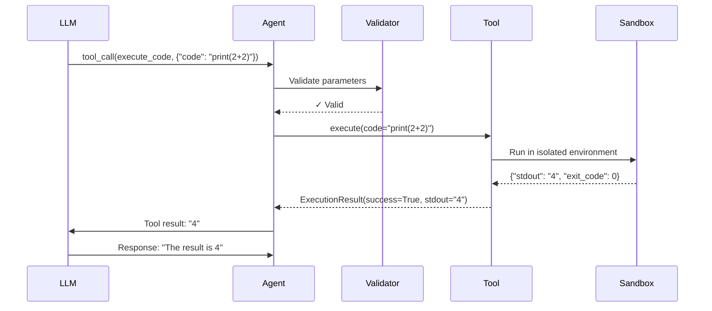

**One-liner:** Tool use enables LLMs to interact with external systems through structured function calls with validated parameters.

## Function Calling Fundamentals

### OpenAI Function Calling Schema
```json
{
  "name": "execute_code",
  "description": "Execute Python code in a sandboxed environment",
  "parameters": {
    "type": "object",
    "properties": {
      "code": {
        "type": "string",
        "description": "Python code to execute"
      },
      "timeout": {
        "type": "integer",
        "description": "Execution timeout in seconds",
        "default": 30
      }
    },
    "required": ["code"]
  }
}
```

### Anthropic Tool Use Format
```json
{
  "name": "execute_code",
  "description": "Execute Python code in a sandboxed environment. Returns stdout, stderr, and exit code.",
  "input_schema": {
    "type": "object",
    "properties": {
      "code": {
        "type": "string",
        "description": "The Python code to execute"
      },
      "timeout": {
        "type": "integer",
        "description": "Maximum execution time in seconds",
        "default": 30
      }
    },
    "required": ["code"]
  }
}
```

**Key components:**
- **Name:** Unique identifier, snake_case
- **Description:** What it does (LLM uses this to decide when to call)
- **Parameters/Input schema:** JSON Schema for validation
- **Required fields:** Enforced by LLM

## Tool Design Patterns

### 1. Single Responsibility
```python
# ✅ Good - Atomic operations
def read_file(path: str) -> str:
    """Read file contents"""
    pass

def write_file(path: str, content: str) -> None:
    """Write content to file"""
    pass

# ❌ Bad - Does too much
def manage_file(path: str, operation: str, content: str = None):
    """Read, write, delete, or list files"""
    pass
```

**Why:** LLM can combine simple tools but struggles with complex multi-mode functions

### 2. Explicit Parameters
```python
# ✅ Good - Clear intent
def search_files(pattern: str, directory: str, case_sensitive: bool = False):
    pass

# ❌ Bad - Magic strings
def search_files(query: str):
    # Parses "*.py in src/ case-insensitive" - brittle!
    pass
```

### 3. Structured Responses
```python
# ✅ Good - Structured result
@dataclass
class ExecutionResult:
    success: bool
    stdout: str
    stderr: str
    exit_code: int
    execution_time_ms: int

# ❌ Bad - Unstructured string
def execute_code(code: str) -> str:
    return "Execution succeeded. Output: Hello\nTime: 1.2s"
```

## Tool Categories

### System Tools
```python
tools = [
    {
        "name": "bash",
        "description": "Execute bash commands",
        "parameters": {"command": str, "timeout": int}
    },
    {
        "name": "read_file",
        "description": "Read file contents",
        "parameters": {"path": str}
    },
    {
        "name": "write_file",
        "description": "Write content to file",
        "parameters": {"path": str, "content": str}
    }
]
```

### API Tools
```python
{
    "name": "web_search",
    "description": "Search the web using Google",
    "parameters": {
        "query": {"type": "string"},
        "num_results": {"type": "integer", "default": 5}
    }
}
```

### Computation Tools
```python
{
    "name": "calculator",
    "description": "Perform mathematical calculations",
    "parameters": {
        "expression": {"type": "string", "description": "Math expression like '2+2*3'"}
    }
}
```

### Agent Control Tools
```python
{
    "name": "ask_human",
    "description": "Ask human for input when uncertain",
    "parameters": {
        "question": {"type": "string"},
        "options": {"type": "array", "items": {"type": "string"}}
    }
}
```

## Tool Execution Flow



**Time complexity:** O(1) validation + O(T) tool execution + O(1) formatting
**Space complexity:** O(N) where N = result size

## Parameter Validation

### JSON Schema Validation
```python
from jsonschema import validate, ValidationError

tool_schema = {
    "type": "object",
    "properties": {
        "code": {"type": "string", "maxLength": 10000},
        "timeout": {"type": "integer", "minimum": 1, "maximum": 300}
    },
    "required": ["code"]
}

def execute_code_tool(parameters: dict):
    try:
        validate(instance=parameters, schema=tool_schema)
    except ValidationError as e:
        return {"error": f"Invalid parameters: {e.message}"}

    code = parameters["code"]
    timeout = parameters.get("timeout", 30)

    return execute_in_sandbox(code, timeout)
```

### Type Hints + Pydantic
```python
from pydantic import BaseModel, Field, validator

class ExecuteCodeParams(BaseModel):
    code: str = Field(..., max_length=10000, description="Python code")
    timeout: int = Field(30, ge=1, le=300, description="Timeout in seconds")

    @validator('code')
    def code_not_empty(cls, v):
        if not v.strip():
            raise ValueError("Code cannot be empty")
        return v

def execute_code_tool(params: ExecuteCodeParams):
    return execute_in_sandbox(params.code, params.timeout)
```

## Error Handling Strategies

### 1. Graceful Degradation
```python
def web_search(query: str) -> dict:
    try:
        return google_search(query)
    except RateLimitError:
        # Fallback to Bing
        return bing_search(query)
    except NetworkError:
        return {
            "error": "Network unavailable",
            "suggestion": "Try asking human or using cached data"
        }
```

### 2. Actionable Error Messages
```python
# ❌ Bad - Vague
return {"error": "File operation failed"}

# ✅ Good - Actionable
return {
    "error": "FileNotFoundError: config.json does not exist",
    "suggestion": "Use list_files() to see available files, or create the file with write_file()",
    "searched_paths": ["/workspace/config.json", "/app/config.json"]
}
```

### 3. Retry Logic
```python
def execute_tool_with_retry(tool, params, max_retries=3):
    for attempt in range(max_retries):
        result = tool.execute(params)

        if result.success:
            return result

        if not is_retryable(result.error):
            return result  # Don't retry permanent failures

        backoff = 2 ** attempt
        time.sleep(backoff)

    return {"error": "Max retries exceeded", "last_error": result.error}

def is_retryable(error: str) -> bool:
    retryable_errors = ["TimeoutError", "ConnectionError", "RateLimitError"]
    return any(err in error for err in retryable_errors)
```

## Parallel Tool Execution

### Sequential (Default)
```python
# Takes 3 seconds total
result1 = search_web("Python tutorials")     # 1s
result2 = read_file("notes.txt")              # 1s
result3 = execute_code("print('hello')")      # 1s
```

### Parallel (Optimized)
```python
import asyncio

async def execute_tools_parallel(tool_calls):
    tasks = [
        search_web("Python tutorials"),
        read_file("notes.txt"),
        execute_code("print('hello')")
    ]

    results = await asyncio.gather(*tasks)
    return results

# Takes 1 second (parallelized)
```

**Speedup:** 3x for independent tools
**Requirement:** Tools must be independent (no data dependencies)

## Tool Chaining

### Static Chaining
```python
# Predefined sequence
result1 = read_file("data.csv")
result2 = analyze_data(result1)
result3 = generate_report(result2)
```

### Dynamic Chaining (Agent-Driven)
```python
# Agent decides next tool based on results
step1 = agent.run("Read the CSV file")
# Agent chooses: read_file("data.csv")

step2 = agent.run(f"Analyze this data: {step1.output}")
# Agent chooses: analyze_data(...)

step3 = agent.run(f"Generate report from: {step2.output}")
# Agent chooses: generate_report(...)
```

## Real-World Tool Examples

### GitHub Tools
```python
tools = [
    {
        "name": "create_issue",
        "description": "Create a GitHub issue",
        "parameters": {
            "title": str,
            "body": str,
            "labels": list[str]
        }
    },
    {
        "name": "create_pr",
        "description": "Create a pull request",
        "parameters": {
            "branch": str,
            "title": str,
            "description": str
        }
    },
    {
        "name": "run_ci",
        "description": "Trigger CI pipeline",
        "parameters": {
            "workflow": str,
            "branch": str
        }
    }
]
```

### Database Tools
```python
{
    "name": "sql_query",
    "description": "Execute read-only SQL query",
    "parameters": {
        "query": {"type": "string"},
        "limit": {"type": "integer", "default": 100}
    },
    "safety": {
        "read_only": True,
        "deny_patterns": ["DROP", "DELETE", "UPDATE", "INSERT"]
    }
}
```

### Slack Tools
```python
{
    "name": "send_message",
    "description": "Send message to Slack channel",
    "parameters": {
        "channel": {"type": "string", "pattern": "^#[a-z-]+$"},
        "message": {"type": "string", "maxLength": 4000},
        "thread_ts": {"type": "string", "description": "Reply in thread"}
    }
}
```

## Tool Permissions & Safety

### Permission System
```python
class ToolPermission(Enum):
    READ = "read"           # Safe, read-only
    WRITE = "write"         # Modifies data
    EXECUTE = "execute"     # Runs code
    NETWORK = "network"     # Makes external calls
    ADMIN = "admin"         # Destructive actions

class Tool:
    def __init__(self, name: str, permissions: list[ToolPermission]):
        self.name = name
        self.permissions = permissions

# Read-only tools - always safe
search_tool = Tool("search", [ToolPermission.READ])

# Requires approval
delete_tool = Tool("delete_file", [ToolPermission.WRITE])
```

### Human-in-the-Loop
```python
def execute_tool(tool: Tool, params: dict, auto_approve: bool = False):
    # Check if tool needs approval
    if ToolPermission.WRITE in tool.permissions and not auto_approve:
        approval = ask_user(
            f"Agent wants to {tool.name}({params}). Approve?",
            options=["Yes", "No", "Yes to all"]
        )

        if approval == "No":
            return {"error": "User denied permission"}

        if approval == "Yes to all":
            auto_approve = True

    return tool.execute(params)
```

### Rate Limiting
```python
from collections import defaultdict
import time

class RateLimiter:
    def __init__(self):
        self.calls = defaultdict(list)

    def check_limit(self, tool_name: str, max_calls: int, window: int):
        now = time.time()
        # Remove old calls outside window
        self.calls[tool_name] = [
            ts for ts in self.calls[tool_name]
            if now - ts < window
        ]

        if len(self.calls[tool_name]) >= max_calls:
            return False, f"Rate limit: {max_calls} calls per {window}s"

        self.calls[tool_name].append(now)
        return True, None

# Usage
rate_limiter = RateLimiter()

def execute_web_search(query: str):
    allowed, error = rate_limiter.check_limit("web_search", max_calls=10, window=60)
    if not allowed:
        return {"error": error}

    return search(query)
```

## Tool Discovery & Documentation

### Auto-Generated Documentation
```python
def generate_tool_docs(tools: list[Tool]) -> str:
    docs = "# Available Tools\n\n"

    for tool in tools:
        docs += f"## {tool.name}\n"
        docs += f"{tool.description}\n\n"
        docs += f"**Parameters:**\n"

        for param, schema in tool.parameters.items():
            required = "**required**" if param in tool.required else "optional"
            docs += f"- `{param}` ({schema['type']}, {required}): {schema.get('description', 'N/A')}\n"

        docs += f"\n**Example:**\n```json\n{tool.example_usage}\n```\n\n"

    return docs
```

### Embedding-Based Tool Selection
```python
# For large tool sets (100+), use semantic search
from sentence_transformers import SentenceTransformer

class ToolSelector:
    def __init__(self, tools: list[Tool]):
        self.tools = tools
        self.model = SentenceTransformer('all-MiniLM-L6-v2')

        # Embed tool descriptions
        descriptions = [f"{t.name}: {t.description}" for t in tools]
        self.embeddings = self.model.encode(descriptions)

    def select_tools(self, task: str, top_k: int = 5) -> list[Tool]:
        # Embed task
        task_embedding = self.model.encode([task])[0]

        # Find most relevant tools
        similarities = cosine_similarity([task_embedding], self.embeddings)[0]
        top_indices = similarities.argsort()[-top_k:][::-1]

        return [self.tools[i] for i in top_indices]

# Usage
selector = ToolSelector(all_tools)
relevant_tools = selector.select_tools("I need to analyze sales data")
# Returns: [read_csv, analyze_data, plot_chart, generate_report, ...]
```

## Performance Optimization

### Tool Result Caching
```python
import hashlib
import json

class ToolCache:
    def __init__(self):
        self.cache = {}

    def cache_key(self, tool_name: str, params: dict) -> str:
        # Create deterministic hash of tool + params
        key_str = f"{tool_name}:{json.dumps(params, sort_keys=True)}"
        return hashlib.sha256(key_str.encode()).hexdigest()

    def get(self, tool_name: str, params: dict):
        key = self.cache_key(tool_name, params)
        return self.cache.get(key)

    def set(self, tool_name: str, params: dict, result, ttl: int = 3600):
        key = self.cache_key(tool_name, params)
        self.cache[key] = {
            "result": result,
            "expires_at": time.time() + ttl
        }

# Usage
cache = ToolCache()

def execute_tool(tool_name: str, params: dict):
    # Check cache
    cached = cache.get(tool_name, params)
    if cached and cached["expires_at"] > time.time():
        return cached["result"]

    # Execute and cache
    result = tools[tool_name].execute(params)
    if result.success and is_cacheable(tool_name):
        cache.set(tool_name, params, result)

    return result
```

**Cacheable tools:** read_file, web_search, api_calls (GET)
**Non-cacheable:** write_file, send_email, delete_record

## Common Pitfalls

### Pitfall 1: Overly complex tools
```python
# ❌ Bad - Too many parameters
def file_operation(
    path: str,
    operation: Literal["read", "write", "delete", "append", "copy"],
    content: str = None,
    destination: str = None,
    encoding: str = "utf-8",
    create_dirs: bool = False
):
    pass

# ✅ Good - Separate tools
def read_file(path: str) -> str: pass
def write_file(path: str, content: str) -> None: pass
def delete_file(path: str) -> None: pass
```

### Pitfall 2: Poor error messages
```python
# ❌ Bad
return {"error": "Failed"}

# ✅ Good
return {
    "success": False,
    "error": "FileNotFoundError: 'data.csv' not found",
    "suggestion": "Use list_files('/data') to see available files",
    "available_operations": ["create new file with write_file()", "check different path"]
}
```

### Pitfall 3: No timeouts
```python
# ❌ Bad - Can hang forever
def web_fetch(url: str):
    return requests.get(url).text

# ✅ Good - Timeout enforced
def web_fetch(url: str, timeout: int = 10):
    try:
        return requests.get(url, timeout=timeout).text
    except requests.Timeout:
        return {"error": f"Request exceeded {timeout}s timeout"}
```

## Key Takeaways

- **Tool design:** Single responsibility, explicit parameters, structured responses
- **Validation is mandatory:** JSON Schema or Pydantic to prevent bad inputs
- **Error messages must be actionable:** Tell LLM what to try next
- **Parallel execution:** 3-10x speedup for independent tools
- **Caching:** Hash(tool + params) → result for deterministic operations
- **Permissions:** READ vs WRITE vs EXECUTE - human approval for destructive
- **Rate limiting:** Prevent abuse of expensive tools (APIs, compute)
- **Tool selection:** Semantic search for large tool sets (100+)

## Interview Focus

- **High frequency:** Tool schema design, validation, error handling
- **Design question:** "Design tools for an agent that manages infrastructure"
- **Trade-offs:** Simple tools vs complex multi-mode, parallel vs sequential
- **Scale:** Caching strategies, rate limiting, tool selection at scale
