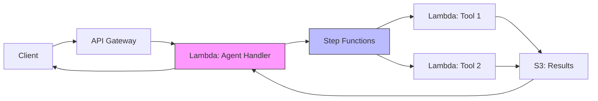
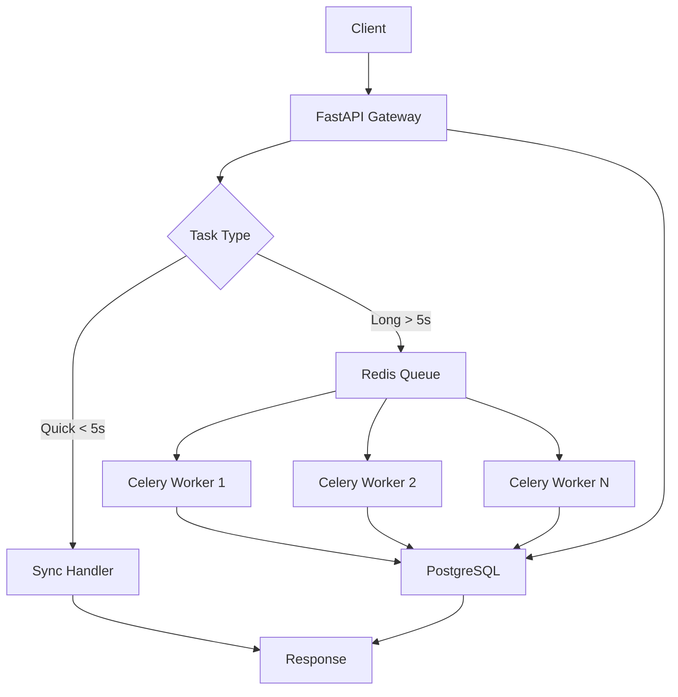

**One-liner:** Production agent systems require frameworks for orchestration and deployment patterns for scale, monitoring, and reliability.

## Popular Agent Frameworks

### Comparison Table

| Framework | Paradigm | Complexity | Best For | Community |
|-----------|----------|------------|----------|-----------|
| **LangChain** | Chain-based | High | Complex workflows | Huge |
| **LlamaIndex** | RAG-first | Medium | Document Q&A | Large |
| **AutoGPT** | Autonomous | Medium | Long-running tasks | Large |
| **CrewAI** | Multi-agent | Medium | Specialized agents | Growing |
| **Semantic Kernel** | Plugin-based | Medium | Microsoft stack | Medium |
| **Custom** | Roll your own | Variable | Full control | N/A |

### LangChain Example

```python
from langchain.agents import initialize_agent, Tool
from langchain.chat_models import ChatOpenAI

# Define tools
tools = [
    Tool(
        name="Calculator",
        func=lambda x: eval(x),
        description="Useful for math calculations"
    ),
    Tool(
        name="Search",
        func=search_web,
        description="Search the web for information"
    )
]

# Initialize agent
llm = ChatOpenAI(model="gpt-4", temperature=0)
agent = initialize_agent(
    tools=tools,
    llm=llm,
    agent="zero-shot-react-description",
    verbose=True,
    max_iterations=5
)

# Run
result = agent.run("What is the square root of 144?")
```

**Pros:** Rich ecosystem, many integrations, active development
**Cons:** Complex API, frequent breaking changes, abstraction overhead

### Custom Framework (Production Pattern)

```python
from dataclasses import dataclass
from typing import Callable, Optional
import asyncio

@dataclass
class Tool:
    name: str
    description: str
    function: Callable
    permissions: list[str]

@dataclass
class AgentStep:
    thought: str
    action: str
    action_input: dict
    observation: str

class Agent:
    def __init__(
        self,
        llm: LLM,
        tools: list[Tool],
        max_steps: int = 10,
        timeout: int = 300
    ):
        self.llm = llm
        self.tools = {t.name: t for t in tools}
        self.max_steps = max_steps
        self.timeout = timeout
        self.history: list[AgentStep] = []

    async def run(self, task: str) -> str:
        """Execute agent loop"""
        context = self._build_context(task)

        for step in range(self.max_steps):
            # LLM decides next action
            response = await self.llm.generate(
                context,
                tools=list(self.tools.values())
            )

            # Parse action
            if response.type == "final_answer":
                return response.content

            # Execute tool
            tool = self.tools[response.tool_name]
            result = await self._execute_tool(tool, response.tool_input)

            # Update history
            self.history.append(AgentStep(
                thought=response.thought,
                action=response.tool_name,
                action_input=response.tool_input,
                observation=result
            ))

            # Update context with result
            context = self._update_context(context, result)

        return "Max steps exceeded"

    async def _execute_tool(self, tool: Tool, params: dict):
        """Execute tool with timeout and error handling"""
        try:
            result = await asyncio.wait_for(
                tool.function(**params),
                timeout=30
            )
            return {"success": True, "output": result}
        except asyncio.TimeoutError:
            return {"success": False, "error": "Tool timeout"}
        except Exception as e:
            return {"success": False, "error": str(e)}

    def _build_context(self, task: str) -> str:
        """Build prompt with task and history"""
        prompt = f"Task: {task}\n\n"

        if self.history:
            prompt += "Previous steps:\n"
            for step in self.history:
                prompt += f"Thought: {step.thought}\n"
                prompt += f"Action: {step.action}({step.action_input})\n"
                prompt += f"Observation: {step.observation}\n\n"

        prompt += "What should you do next?"
        return prompt
```

**Pros:** Full control, optimized for your use case, minimal dependencies
**Cons:** More work upfront, need to handle edge cases

## Deployment Architectures

### 1. Serverless (AWS Lambda + API Gateway)



**Setup:**
```python
# lambda_handler.py
import json
from agent import Agent

def lambda_handler(event, context):
    task = event['body']['task']
    user_id = event['requestContext']['authorizer']['userId']

    # Initialize agent
    agent = Agent(
        llm=get_llm(),
        tools=load_tools(),
        max_steps=10
    )

    # Execute (with timeout)
    try:
        result = agent.run(task, timeout=60)  # Lambda max: 15 min
        return {
            'statusCode': 200,
            'body': json.dumps({'result': result})
        }
    except TimeoutError:
        return {
            'statusCode': 202,
            'body': json.dumps({
                'status': 'processing',
                'job_id': start_async_job(task, user_id)
            })
        }
```

**Pros:**
- Zero ops (auto-scaling)
- Pay-per-use
- Built-in redundancy

**Cons:**
- Cold start latency (1-3s)
- 15 min max timeout
- Stateless (need external state management)

**Cost:** ~$0.20 per 1M requests (assuming 2GB RAM, 30s avg execution)

### 2. Container-Based (Kubernetes)

```yaml
# agent-deployment.yaml
apiVersion: apps/v1
kind: Deployment
metadata:
  name: agent-api
spec:
  replicas: 3
  selector:
    matchLabels:
      app: agent
  template:
    metadata:
      labels:
        app: agent
    spec:
      containers:
      - name: agent
        image: myregistry/agent:latest
        resources:
          requests:
            memory: "2Gi"
            cpu: "1"
          limits:
            memory: "4Gi"
            cpu: "2"
        env:
        - name: OPENAI_API_KEY
          valueFrom:
            secretKeyRef:
              name: api-keys
              key: openai
        livenessProbe:
          httpGet:
            path: /health
            port: 8000
          initialDelaySeconds: 30
          periodSeconds: 10
        readinessProbe:
          httpGet:
            path: /ready
            port: 8000
```

**Agent service:**
```python
from fastapi import FastAPI, BackgroundTasks
import uvicorn

app = FastAPI()

@app.post("/execute")
async def execute_agent(task: str, background_tasks: BackgroundTasks):
    # Quick validation
    if len(task) > 10000:
        return {"error": "Task too long"}

    # Start async execution
    job_id = generate_job_id()
    background_tasks.add_task(run_agent_async, job_id, task)

    return {"job_id": job_id, "status": "started"}

@app.get("/status/{job_id}")
async def get_status(job_id: str):
    result = redis.get(f"job:{job_id}")
    return json.loads(result)

async def run_agent_async(job_id: str, task: str):
    agent = Agent(...)
    result = await agent.run(task)

    redis.setex(
        f"job:{job_id}",
        3600,  # 1 hour TTL
        json.dumps(result)
    )

if __name__ == "__main__":
    uvicorn.run(app, host="0.0.0.0", port=8000)
```

**Pros:**
- Full control over environment
- Stateful if needed
- No timeout limits
- Can run background jobs

**Cons:**
- More ops overhead
- Need to manage scaling
- Higher baseline cost

**Cost:** ~$200/month (3 × m5.large instances)

### 3. Hybrid (API + Background Workers)



**API Gateway:**
```python
from fastapi import FastAPI
from celery import Celery

app = FastAPI()
celery = Celery('agent', broker='redis://localhost:6379/0')

@app.post("/execute")
async def execute(task: str, sync: bool = False):
    if sync:
        # Synchronous execution (quick tasks)
        result = agent.run(task, timeout=5)
        return {"result": result}
    else:
        # Async execution (long tasks)
        job = celery_run_agent.delay(task)
        return {"job_id": job.id, "status": "queued"}

@app.get("/result/{job_id}")
async def get_result(job_id: str):
    job = AsyncResult(job_id, app=celery)
    return {
        "status": job.state,
        "result": job.result if job.ready() else None
    }
```

**Worker:**
```python
@celery.task(bind=True, max_retries=3)
def celery_run_agent(self, task: str):
    try:
        agent = Agent(...)
        result = agent.run(task, timeout=300)
        return result
    except Exception as e:
        # Retry with exponential backoff
        raise self.retry(exc=e, countdown=2 ** self.request.retries)
```

**Pros:**
- Fast response for sync requests
- Handles long-running tasks
- Worker auto-scaling
- Easy retry logic

**Cons:**
- More complex architecture
- Need message queue (Redis/RabbitMQ)
- Task persistence layer

**Cost:** ~$300/month (API servers + workers + Redis + Postgres)

## Monitoring & Observability

### 1. Metrics to Track

```python
from prometheus_client import Counter, Histogram, Gauge

# Request metrics
agent_requests = Counter(
    'agent_requests_total',
    'Total agent requests',
    ['user_id', 'status']
)

agent_duration = Histogram(
    'agent_duration_seconds',
    'Agent execution time',
    buckets=[1, 5, 10, 30, 60, 120, 300]
)

agent_steps = Histogram(
    'agent_steps_count',
    'Number of steps taken',
    buckets=[1, 3, 5, 10, 20, 50]
)

# Tool metrics
tool_calls = Counter(
    'tool_calls_total',
    'Tool invocations',
    ['tool_name', 'status']
)

tool_duration = Histogram(
    'tool_duration_seconds',
    'Tool execution time',
    ['tool_name']
)

# LLM metrics
llm_tokens = Counter(
    'llm_tokens_total',
    'LLM tokens used',
    ['model', 'type']  # type: prompt/completion
)

llm_cost = Counter(
    'llm_cost_dollars',
    'LLM cost in USD',
    ['model']
)

# Error metrics
agent_errors = Counter(
    'agent_errors_total',
    'Agent errors',
    ['error_type']
)
```

### 2. Logging Structure

```python
import structlog

logger = structlog.get_logger()

class Agent:
    def run(self, task: str) -> str:
        log = logger.bind(
            task_id=generate_id(),
            user_id=self.user_id,
            task_length=len(task)
        )

        log.info("agent_started", task=task[:100])

        for step_num in range(self.max_steps):
            step_log = log.bind(step=step_num)

            step_log.info("step_started")

            # Execute step
            tool_name, params = self.decide_action()
            step_log.info("tool_called", tool=tool_name, params=params)

            result = self.execute_tool(tool_name, params)
            step_log.info("tool_completed", success=result.success)

            if not result.success:
                step_log.error("tool_failed", error=result.error)

        log.info("agent_completed", steps=step_num)
        return result

# Produces structured logs:
# {
#   "event": "agent_started",
#   "task_id": "abc123",
#   "user_id": "user_456",
#   "task": "Search for...",
#   "timestamp": "2025-01-15T10:30:00Z"
# }
```

### 3. Distributed Tracing

```python
from opentelemetry import trace
from opentelemetry.instrumentation.requests import RequestsInstrumentor

tracer = trace.get_tracer(__name__)

class Agent:
    async def run(self, task: str):
        with tracer.start_as_current_span("agent.run") as span:
            span.set_attribute("task.length", len(task))
            span.set_attribute("user.id", self.user_id)

            for step in range(self.max_steps):
                with tracer.start_as_current_span("agent.step") as step_span:
                    step_span.set_attribute("step.number", step)

                    # Tool execution creates child span
                    result = await self.execute_tool(tool_name, params)

                    step_span.set_attribute("tool.name", tool_name)
                    step_span.set_attribute("tool.success", result.success)

            span.set_attribute("steps.total", step)
            return result

# Visualize in Jaeger/Datadog:
# agent.run [2.5s]
#   ├─ agent.step.0 [500ms]
#   │   └─ tool.search [400ms]
#   ├─ agent.step.1 [1.2s]
#   │   └─ tool.execute_code [1.1s]
#   └─ agent.step.2 [300ms]
#       └─ tool.write_file [200ms]
```

## Error Handling & Recovery

### Circuit Breaker Pattern

```python
from enum import Enum
import time

class CircuitState(Enum):
    CLOSED = "closed"      # Normal operation
    OPEN = "open"          # Failing, reject requests
    HALF_OPEN = "half_open"  # Testing if recovered

class CircuitBreaker:
    def __init__(
        self,
        failure_threshold: int = 5,
        success_threshold: int = 2,
        timeout: int = 60
    ):
        self.failure_threshold = failure_threshold
        self.success_threshold = success_threshold
        self.timeout = timeout

        self.failures = 0
        self.successes = 0
        self.state = CircuitState.CLOSED
        self.last_failure_time = None

    def call(self, func, *args, **kwargs):
        if self.state == CircuitState.OPEN:
            if time.time() - self.last_failure_time > self.timeout:
                # Try half-open
                self.state = CircuitState.HALF_OPEN
            else:
                raise CircuitBreakerOpen("Circuit breaker is open")

        try:
            result = func(*args, **kwargs)
            self._on_success()
            return result
        except Exception as e:
            self._on_failure()
            raise

    def _on_success(self):
        self.failures = 0

        if self.state == CircuitState.HALF_OPEN:
            self.successes += 1
            if self.successes >= self.success_threshold:
                self.state = CircuitState.CLOSED
                self.successes = 0

    def _on_failure(self):
        self.failures += 1
        self.last_failure_time = time.time()
        self.successes = 0

        if self.failures >= self.failure_threshold:
            self.state = CircuitState.OPEN

# Usage
llm_breaker = CircuitBreaker(failure_threshold=5, timeout=60)

def call_llm(prompt):
    return llm_breaker.call(llm.generate, prompt)
```

### Retry with Backoff

```python
import asyncio
from typing import TypeVar, Callable

T = TypeVar('T')

async def retry_with_backoff(
    func: Callable[..., T],
    max_retries: int = 3,
    base_delay: float = 1.0,
    max_delay: float = 60.0,
    exponential_base: float = 2.0
) -> T:
    """Retry with exponential backoff"""

    for attempt in range(max_retries):
        try:
            return await func()
        except Exception as e:
            if attempt == max_retries - 1:
                raise

            # Calculate delay
            delay = min(
                base_delay * (exponential_base ** attempt),
                max_delay
            )

            logger.warning(
                "retry_attempt",
                attempt=attempt + 1,
                max_retries=max_retries,
                delay=delay,
                error=str(e)
            )

            await asyncio.sleep(delay)

# Usage
result = await retry_with_backoff(
    lambda: llm.generate(prompt),
    max_retries=3,
    base_delay=1.0
)
```

## Cost Optimization

### Token Budgets

```python
class TokenBudget:
    def __init__(self, max_tokens: int):
        self.max_tokens = max_tokens
        self.used_tokens = 0

    def check(self, estimated_tokens: int) -> bool:
        if self.used_tokens + estimated_tokens > self.max_tokens:
            return False
        return True

    def consume(self, tokens: int):
        self.used_tokens += tokens

    def remaining(self) -> int:
        return self.max_tokens - self.used_tokens

# Usage
budget = TokenBudget(max_tokens=100_000)  # ~$0.30 for GPT-4

agent = Agent(llm=llm, token_budget=budget)

for step in agent_loop:
    estimated = estimate_tokens(prompt)

    if not budget.check(estimated):
        return "Token budget exceeded"

    response = llm.generate(prompt)
    budget.consume(response.usage.total_tokens)
```

### Caching & Deduplication

```python
# Hash identical requests
import hashlib

def request_hash(prompt: str, model: str) -> str:
    return hashlib.sha256(f"{model}:{prompt}".encode()).hexdigest()

# Cache LLM responses
llm_cache = {}

def cached_llm_call(prompt: str, model: str):
    key = request_hash(prompt, model)

    if key in llm_cache:
        return llm_cache[key]  # Save $$$

    response = llm.generate(prompt, model=model)
    llm_cache[key] = response

    return response

# Typical cache hit rate: 20-40% → 20-40% cost savings
```

## Key Takeaways

- **Framework choice:** Custom = control, LangChain = ecosystem, pick based on needs
- **Deployment:** Serverless (simple) → Containers (control) → Hybrid (best of both)
- **Monitoring is mandatory:** Metrics, logs, traces for production debugging
- **Circuit breakers:** Prevent cascade failures when dependencies fail
- **Token budgets:** Control LLM costs with hard limits per request
- **Caching:** 20-40% cost reduction for repeated operations
- **Async workers:** Handle long tasks without blocking API
- **Error handling:** Retry with backoff, graceful degradation, fallbacks

## Interview Focus

- **High frequency:** Deployment patterns, monitoring, error handling
- **Design question:** "Design a production agent system for 10K users"
- **Trade-offs:** Serverless vs containers, sync vs async, cost vs latency
- **Scale:** Horizontal scaling, load balancing, queue management
