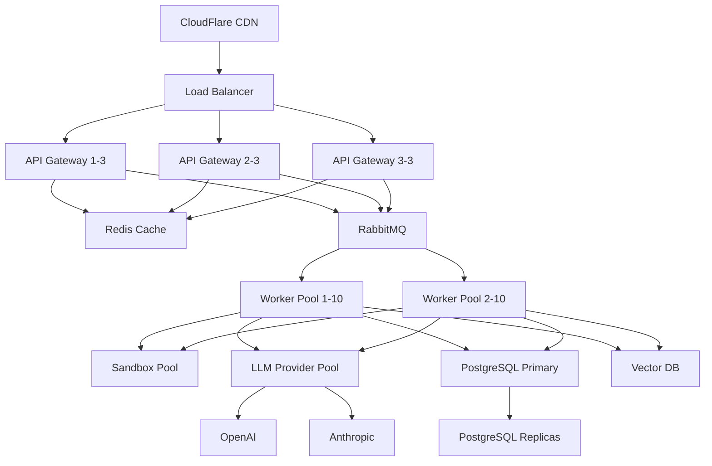

**One-liner:** Test your understanding of agent frameworks, deployment architectures, monitoring, and production operations.

## Conceptual Questions

### Q1: When should you build a custom agent framework vs using LangChain?
<details>
<summary>Answer</summary>

**Use LangChain when:**
- **Prototyping:** Quick proof-of-concept, iterate fast
- **Standard use cases:** RAG, chatbots, simple agents
- **Ecosystem matters:** Need integrations with 100+ tools/services
- **Team experience:** Team knows LangChain well
- **Time-to-market:** Ship in days, not weeks

**Build custom when:**
- **Performance critical:** LangChain abstraction overhead too high
- **Specific requirements:** Unique workflows LangChain doesn't support
- **Long-term maintenance:** Avoid breaking changes in fast-moving library
- **Fine control needed:** Exact token counting, custom retry logic
- **Scale:** Handling 1M+ requests/day, need optimization

**Hybrid approach (recommended):**
```python
# Use LangChain components, custom orchestration
from langchain.llms import OpenAI
from langchain.embeddings import OpenAIEmbeddings

# Custom agent loop
class CustomAgent:
    def __init__(self):
        self.llm = OpenAI()  # Use LangChain's LLM wrapper
        self.embeddings = OpenAIEmbeddings()  # Use embeddings

        # Custom logic
        self.max_steps = 10
        self.custom_error_handling = MyErrorHandler()
        self.custom_cache = MyCache()

    def run(self, task):
        # Your custom agent loop
        pass
```

**Real-world:**
- GitHub Copilot Workspace: Custom (performance-critical)
- Many startups: LangChain → custom as they scale
- ChatGPT plugins: Custom (OpenAI's framework)

**Staff-level insight:** Start with framework, extract and customize hot paths as you scale
</details>

### Q2: Compare serverless vs container deployment for agents
<details>
<summary>Answer</summary>

| Aspect | Serverless (Lambda) | Containers (K8s) |
|--------|---------------------|------------------|
| **Cold start** | 1-3s (warm: 10ms) | None (always warm) |
| **Max timeout** | 15 min (Lambda) | Unlimited |
| **Scaling** | Automatic (1000s RPS) | Manual HPA rules |
| **Cost** | Pay-per-use ($0.20/1M) | Always on (~$200/mo) |
| **State** | Stateless (need external) | Stateful possible |
| **Ops** | Zero (managed) | Medium (K8s) |
| **Startup** | Minutes | Hours/days |

**Serverless - Use when:**
- Spiky/unpredictable traffic
- Short tasks (<15 min)
- Want zero ops
- Low baseline cost

**Containers - Use when:**
- Consistent high traffic
- Long-running tasks (>15 min)
- Need stateful connections
- Full control required

**Example scenarios:**

**Chatbot (serverless):**
```
Traffic: 1000 requests/day (spiky)
Avg duration: 3s
Cost: ~$5/month (serverless) vs $200/month (containers)
Decision: Serverless (95% cost savings)
```

**Code analysis agent (containers):**
```
Traffic: Steady 50 RPS
Avg duration: 30s
Need: WebSocket connections, state
Cost: ~$500/month (both options similar)
Decision: Containers (better features, similar cost)
```

**Hybrid pattern (best of both):**
```python
# API in serverless (fast, cheap)
lambda_handler():
    if task.estimated_duration < 60:
        return execute_sync(task)  # Run in Lambda
    else:
        enqueue_to_workers(task)   # Long task → containers

# Workers in containers (long tasks)
celery_worker():
    while True:
        task = queue.get()
        execute_long_task(task)
```

**Staff-level insight:** Most production systems use hybrid - API in serverless, workers in containers
</details>

### Q3: What metrics are critical for monitoring agent systems?
<details>
<summary>Answer</summary>

**1. Request metrics:**
```python
# Volume
requests_per_second
requests_per_user
requests_per_endpoint

# Latency
p50_latency      # Median: 2s
p95_latency      # 95th: 5s
p99_latency      # 99th: 10s (outliers)

# Status
success_rate     # Target: >99%
error_rate
timeout_rate
```

**2. Agent-specific metrics:**
```python
# Execution
steps_per_task           # Avg: 5-7 steps
steps_distribution       # Histogram: [1-3: 40%, 4-7: 45%, 8-10: 15%]
max_steps_reached_rate   # Should be <5%

# Token usage (cost)
tokens_per_request       # Avg: 5000 tokens
tokens_by_model          # GPT-4: 3000, GPT-3.5: 2000
cost_per_request         # Avg: $0.05
cost_per_user_per_day    # Budget tracking
```

**3. Tool metrics:**
```python
# Usage
tool_call_frequency      # Which tools used most
tool_call_distribution   # Histogram by tool
tool_success_rate        # Per tool: 95-99%

# Performance
tool_latency_by_type     # code_exec: 2s, read_file: 50ms
tool_timeout_rate
tool_retry_rate
```

**4. Error metrics:**
```python
# Types
errors_by_type           # TimeoutError: 10%, ValidationError: 5%
errors_by_tool
errors_by_user

# Patterns
error_cascade_rate       # Same error 3+ times
circuit_breaker_trips    # When dependencies fail
retry_exhaustion_rate    # Gave up after retries
```

**5. Cost metrics:**
```python
# LLM costs
llm_cost_per_request
llm_cost_per_user
llm_cost_trend           # Growing? Optimize!

# Infrastructure costs
compute_cost_per_request
total_daily_burn_rate

# Efficiency
cost_per_successful_task
cost_per_token
cache_hit_rate           # Higher = more savings
```

**Dashboard layout:**
```
┌─────────────────────────────────────┐
│ Overview (last 24h)                 │
│ • Requests: 1.2M (↑ 10%)            │
│ • Success rate: 99.2%               │
│ • P95 latency: 4.5s                 │
│ • Cost: $150 (↓ 5% from caching)    │
└─────────────────────────────────────┘

┌──────────────┬──────────────┐
│ Latency      │ Error Rate   │
│ [Graph]      │ [Graph]      │
└──────────────┴──────────────┘

┌──────────────┬──────────────┐
│ Tool Usage   │ Cost Trend   │
│ [Bar chart]  │ [Line graph] │
└──────────────┴──────────────┘
```

**Alerts to configure:**
```python
alerts = {
    "critical": [
        ("error_rate > 5%", "Slack + PagerDuty"),
        ("p95_latency > 30s", "Slack + PagerDuty"),
        ("llm_api_down", "PagerDuty"),
    ],
    "warning": [
        ("success_rate < 98%", "Slack"),
        ("daily_cost > $500", "Email"),
        ("cache_hit_rate < 30%", "Email"),
    ]
}
```

**Staff-level insight:** P95 > P50 for agents - focus on tail latency and error patterns
</details>

## Design Questions

### Q4: Design a production agent system for 10,000 concurrent users
<details>
<summary>Answer</summary>

**Requirements:**
- 10K concurrent users
- Each session: 10 agent steps, 5 tool calls, 30s avg
- Uptime: 99.9% (8.76 hours downtime/year)
- Latency: P95 < 5s per step

**Architecture:**



**Component sizing:**

**1. API Gateway:**
```python
# Capacity calculation
concurrent_users = 10_000
requests_per_user_per_minute = 2  # New step every 30s
total_rps = (concurrent_users * requests_per_user_per_minute) / 60
# = 333 RPS

# With 3 gateways: 111 RPS each
# FastAPI handles 1000+ RPS on m5.large
# Result: 3 × m5.large (headroom)
```

**2. Worker Pool:**
```python
# Worker calculation
concurrent_sessions = 10_000
avg_duration_per_step = 5  # seconds
steps_per_session = 10

# Concurrent tasks at any moment
concurrent_tasks = (concurrent_users * avg_duration_per_step) / 30
# = 1,667 tasks

# Workers needed (1 task per worker)
workers = 1_667 / 0.8  # 80% utilization target
# = ~2,000 workers

# Container sizing: 10 workers per m5.2xlarge
# Result: 200 × m5.2xlarge
```

**3. LLM API calls:**
```python
# LLM requests
steps_per_second = 333  # From RPS calculation
tokens_per_step = 5_000  # 3K prompt + 2K completion

# Total tokens/sec
tokens_per_second = steps_per_second * tokens_per_step
# = 1.67M tokens/sec

# Cost
cost_per_1k_tokens = 0.03  # GPT-4
cost_per_second = (tokens_per_second / 1000) * cost_per_1k_tokens
# = $50/sec = $3,000/min = $130K/day

# Optimization: Use GPT-3.5 for simple tasks (90% of cases)
# New cost: $13K/day (10x reduction)
```

**4. Sandbox pool:**
```python
# Only 20% of steps use code execution
code_execution_steps_per_sec = 333 * 0.2 = 66
avg_execution_time = 3  # seconds

concurrent_sandboxes = 66 * 3 = 200

# With pooling: Pre-warm 300 containers (headroom)
# Resource: 300 × 512MB = 150GB RAM
# Machines: 150GB / 32GB per m5.2xlarge = 5 machines
```

**5. Caching:**
```python
# Redis for caching
cache_entries = 1_000_000  # 1M cached results
avg_entry_size = 10KB
total_cache_size = 10GB

# Redis: 1 × r5.xlarge (26GB RAM)
```

**6. Database:**
```python
# PostgreSQL for persistence
sessions_per_day = 10_000 * 10  # 10 sessions per user
data_per_session = 50KB
daily_writes = 10_000 * 10 * 50KB = 5GB/day
monthly = 150GB/month

# Primary: db.m5.2xlarge
# Replicas: 3 × db.m5.xlarge (read scaling)
```

**Failure handling:**

**1. LLM provider failure:**
```python
# Multi-provider fallback
def call_llm(prompt):
    providers = [
        (openai, priority=1),
        (anthropic, priority=2),
        (self_hosted, priority=3)
    ]

    for provider, _ in sorted(providers, key=lambda x: x[1]):
        try:
            return provider.generate(prompt)
        except ProviderError:
            continue  # Try next

    raise AllProvidersDown()
```

**2. Worker failure:**
```python
# RabbitMQ with ack
def process_task(task):
    try:
        result = agent.run(task)
        queue.ack(task)  # Remove from queue
        return result
    except Exception:
        queue.nack(task)  # Re-queue for retry
        raise
```

**3. Database failure:**
```python
# Auto-failover to replica
if not primary.is_healthy():
    promote_replica_to_primary()
    update_connection_string()
```

**Cost breakdown:**
```
API Gateways: 3 × $70 = $210/mo
Workers: 200 × $70 = $14,000/mo
Sandbox hosts: 5 × $70 = $350/mo
Redis: 1 × $50 = $50/mo
PostgreSQL: 4 × $100 = $400/mo
Load Balancer: $50/mo
LLM API (optimized): $13K/day × 30 = $390K/mo

Total: ~$405K/month

Per user: $405K / 10K = $40/user/month
```

**Optimizations to reduce cost:**

1. **Aggressive caching:** 40% hit rate → $156K/mo savings
2. **Smaller models:** GPT-3.5 for 90% → $300K → $40K (90% savings)
3. **Prompt compression:** Reduce tokens by 30% → $12K/mo savings
4. **Spot instances:** 70% discount on workers → $10K/mo

**After optimizations: ~$80K/month ($8/user)**
</details>

### Q5: How would you debug a production agent that's timing out?
<details>
<summary>Answer</summary>

**Step-by-step debugging:**

**1. Check metrics dashboard:**
```python
# Look for patterns
- Is timeout rate elevated? (Normal: <1%, Current: 10%)
- Which users/sessions affected? (All vs specific)
- When did it start? (Gradual vs sudden)
- Which step/tool timing out? (Code execution vs LLM call)
```

**2. Examine distributed traces:**
```python
# Find slow trace
trace_id = get_timeout_trace_id()
trace = jaeger.get_trace(trace_id)

# Analyze spans
for span in trace.spans:
    print(f"{span.operation}: {span.duration}")

# Example output:
# agent.run: 35s (TIMEOUT at 30s)
#   ├─ agent.step.0: 500ms
#   ├─ agent.step.1: 28s (!!!)
#   │   └─ tool.execute_code: 27.8s (!!)
#   │       └─ sandbox.exec: 27.5s
#   └─ [timeout]

# Root cause: Code execution taking too long
```

**3. Check logs:**
```bash
# Filter for timeouts
kubectl logs -l app=agent --since=1h | grep timeout

# Look for patterns
{
  "level": "error",
  "event": "task_timeout",
  "task_id": "abc123",
  "step": 2,
  "tool": "execute_code",
  "code_preview": "while True: pass",  # Aha! Infinite loop
  "timeout_duration": 30
}
```

**4. Reproduce locally:**
```python
# Extract failing request from logs
task = get_task_from_logs("abc123")

# Run locally with debugging
agent = Agent(debug=True, timeout=None)  # No timeout for debugging
result = agent.run(task)

# Add breakpoints
import pdb; pdb.set_trace()

# Or use profiling
import cProfile
cProfile.run('agent.run(task)', sort='cumtime')
```

**5. Common timeout causes & fixes:**

**Cause 1: LLM API slowness**
```python
# Check LLM provider status
if llm_latency.p95 > 10s:
    # Solution: Add timeout + fallback
    try:
        response = llm.generate(prompt, timeout=5)
    except TimeoutError:
        # Use faster model
        response = fast_llm.generate(compressed_prompt)
```

**Cause 2: Code execution hanging**
```python
# Infinite loops, long-running code
def execute_code(code):
    # Add multiple timeout layers
    # Layer 1: Container-level
    container.run(code, timeout=10)

    # Layer 2: Process-level
    signal.alarm(12)  # 2s buffer

    # Layer 3: Monitoring
    monitor_thread = start_monitoring(max_duration=15)
```

**Cause 3: Database query slowness**
```python
# Check query performance
slow_queries = db.get_slow_queries(threshold=1000)  # >1s

# Solution: Add indexes
CREATE INDEX idx_user_sessions ON sessions(user_id, created_at);

# Or use read replicas
if query_type == "read":
    db = replica_connection  # Offload from primary
```

**Cause 4: Tool chaining delays**
```python
# Sequential tools taking too long
# Current: read_file (100ms) + process (500ms) + write (100ms) = 700ms
# But 10 tools = 7s!

# Solution: Parallel execution where possible
results = await asyncio.gather(
    read_file("file1.txt"),
    read_file("file2.txt"),
    read_file("file3.txt")
)  # 100ms instead of 300ms
```

**Cause 5: Memory leak**
```python
# Check memory usage
memory_usage = get_pod_memory()
if memory_usage > 80%:
    # Garbage collection pauses
    # Solution: Increase memory or fix leak

    # Find leak
    import tracemalloc
    tracemalloc.start()
    agent.run(task)
    snapshot = tracemalloc.take_snapshot()
    top_stats = snapshot.statistics('lineno')
    for stat in top_stats[:10]:
        print(stat)
```

**6. Implement fix + verify:**
```python
# Deploy fix with canary
- Deploy to 10% of traffic
- Monitor timeout rate
- If improved: Roll out to 100%
- If not: Rollback, continue debugging

# Verify improvement
before = timeout_rate_last_week  # 10%
after = timeout_rate_now         # 1%
improvement = (before - after) / before  # 90% reduction ✓
```

**7. Add monitoring to prevent recurrence:**
```python
# Alert on elevated timeouts
alert(
    "timeout_rate > 5% for 5 minutes",
    severity="critical",
    channels=["slack", "pagerduty"]
)

# Dashboard widget
timeout_by_tool = Counter("timeouts", ["tool_name"])
# Visualize which tools timing out
```
</details>

## Scenario Questions

### Q6: Your LLM provider (OpenAI) goes down. How do you handle it?
<details>
<summary>Answer</summary>

**Immediate response (automatic):**

**1. Multi-provider fallback:**
```python
class LLMProvider:
    def __init__(self):
        self.providers = [
            OpenAIProvider(priority=1),
            AnthropicProvider(priority=2),
            SelfHostedProvider(priority=3)
        ]

    def generate(self, prompt, model="gpt-4"):
        for provider in self.providers:
            try:
                # Check circuit breaker
                if provider.circuit_breaker.is_open:
                    continue

                return provider.generate(prompt, model)

            except ProviderError as e:
                logger.warning(f"{provider.name} failed: {e}")
                provider.circuit_breaker.record_failure()
                continue  # Try next provider

        raise AllProvidersDown("All LLM providers unavailable")

# When OpenAI goes down:
# 1. Circuit breaker opens (after 5 failures)
# 2. Auto-fallback to Anthropic
# 3. Users unaffected (except slight latency)
```

**2. Graceful degradation:**
```python
def execute_agent(task):
    try:
        return agent.run(task, llm=primary_llm)

    except AllProvidersDown:
        # Degraded mode: Use cached responses
        cached = get_cached_response(task)
        if cached:
            return {
                "result": cached,
                "warning": "Using cached response due to service degradation"
            }

        # Or use smaller local model
        return agent.run(task, llm=local_llm)  # Llama 3 8B
```

**Short-term (minutes):**

**1. Status page update:**
```python
# Auto-update status page
status_page.post_incident(
    title="Elevated latency due to upstream provider",
    status="degraded",
    message="We're experiencing issues with our primary LLM provider. "
            "Your requests are being routed to backup providers."
)
```

**2. Alert team:**
```python
# PagerDuty alert
pagerduty.trigger_incident(
    title="OpenAI provider down",
    severity="high",
    details={
        "provider": "OpenAI",
        "error_rate": "100%",
        "fallback_active": "Anthropic"
    }
)
```

**3. Monitor fallback:**
```python
# Dashboard: Track fallback provider
metrics.increment("llm_provider_switch", tags=["from:openai", "to:anthropic"])

# Check if fallback can handle load
if anthropic_error_rate > 5%:
    alert("Fallback provider also struggling")
    scale_up_self_hosted()
```

**Long-term (hours/days if still down):**

**1. Scale backup providers:**
```python
# Increase rate limits with Anthropic
anthropic.request_rate_limit_increase(
    from_rpm=100_000,
    to_rpm=500_000
)

# Spin up more self-hosted capacity
self_hosted.scale_up(replicas=10)
```

**2. Cost analysis:**
```python
# Anthropic is more expensive
# Before: OpenAI $0.03/1K tokens
# Now: Anthropic $0.045/1K tokens (50% more expensive)

daily_cost_increase = (daily_tokens / 1000) * (0.045 - 0.03)
# = $1.5K/day extra

# Acceptable for short-term, but optimize if prolonged
```

**3. Communicate with users:**
```python
# Email to affected users
if outage_duration > 1_hour:
    email_users(
        subject="Service update",
        body="We experienced degraded performance due to an upstream "
             "provider outage. Your service has been maintained through "
             "backup providers. We apologize for any inconvenience."
    )
```

**Post-mortem (after resolution):**

**1. Analyze impact:**
```
- Duration: 3 hours
- Requests affected: 50,000
- Fallback success rate: 98%
- User-visible errors: 2%
- Extra cost: $4,500
```

**2. Improvements:**
```python
# Action items from incident:
1. Increase Anthropic rate limit permanently (prevent bottleneck)
2. Add third provider (Google Gemini) for more redundancy
3. Improve circuit breaker tuning (failed too slow)
4. Cache more aggressively (would've helped 30% of requests)
5. Better status page automation
```

**3. Test disaster recovery:**
```python
# Quarterly chaos engineering
def test_provider_failover():
    # Simulate OpenAI down
    openai_provider.simulate_failure()

    # Run test traffic
    for _ in range(100):
        result = agent.run(test_task)
        assert result.success  # Should use fallback

    # Verify metrics
    assert fallback_success_rate > 95%

# Schedule: Every quarter
```
</details>

## Key Takeaways

- **Framework choice:** Custom = control, LangChain = speed, pick based on maturity
- **Deployment:** Serverless (simple, spiky traffic) vs Containers (complex, steady load)
- **Critical metrics:** P95 latency, error rate, cost per request, tool success rates
- **Multi-provider fallback:** Essential for LLM reliability (OpenAI → Anthropic → self-hosted)
- **Circuit breakers:** Prevent cascade failures, auto-recover
- **Monitoring:** Metrics + Logs + Traces = complete observability
- **Cost optimization:** Caching (40% savings), smaller models (90% savings), compression
- **Capacity planning:** Calculate concurrent tasks, size workers appropriately

## Self-Test Checklist

Can you:
- [ ] Compare custom framework vs LangChain trade-offs?
- [ ] Design serverless vs container deployment?
- [ ] List critical metrics for agent monitoring?
- [ ] Size infrastructure for 10K concurrent users?
- [ ] Debug a production timeout systematically?
- [ ] Implement multi-provider LLM fallback?
- [ ] Calculate cost per request?
- [ ] Design a circuit breaker pattern?
- [ ] Set up distributed tracing?
- [ ] Handle provider outages gracefully?
